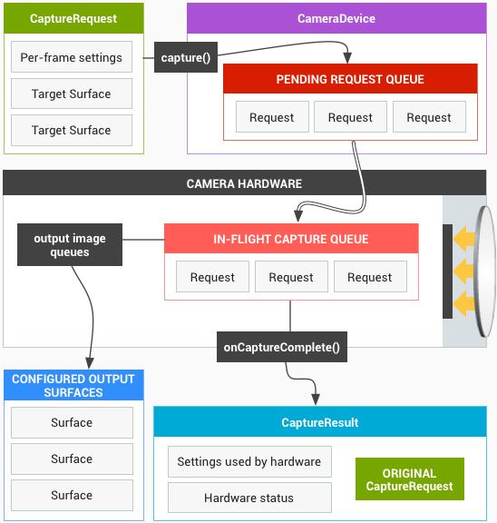
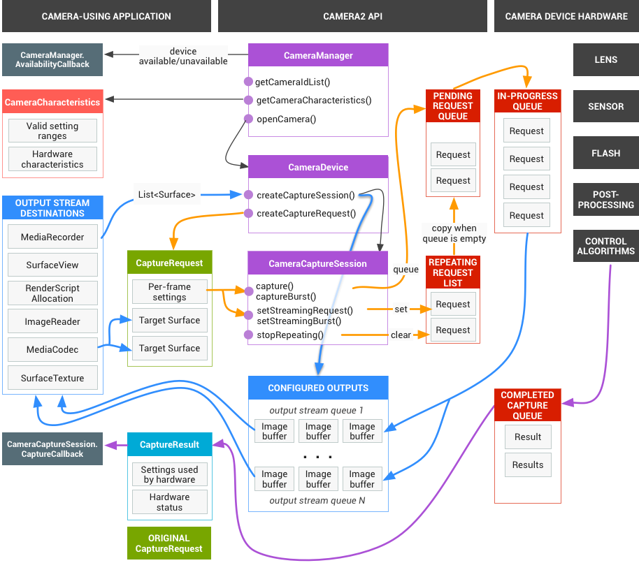
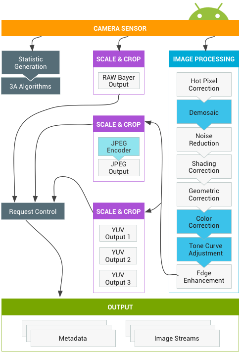
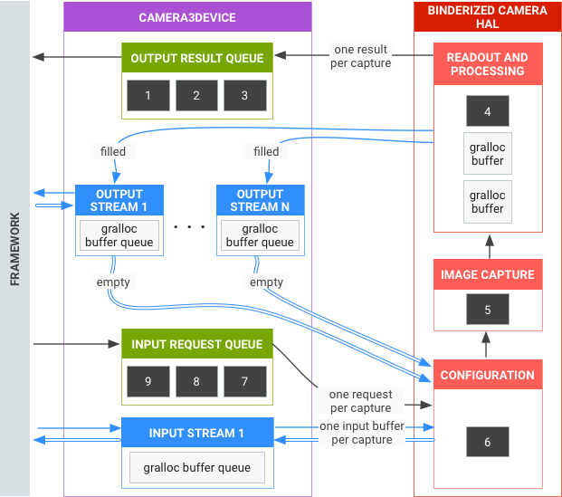
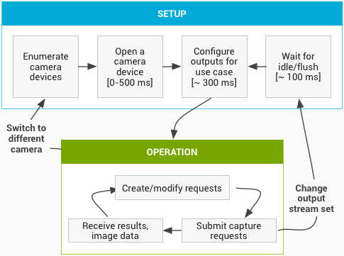

<https://source.android.com/devices/camera>

# Camera

## overview

Android's camera **Hardware Abstraction Layer (HAL)** connects the higher level **camera framework API**s in Camera 2 to your underlying **camera driver and hardware**. The camera subsystem includes implementations for **camera pipeline components** while the camera HAL provides interfaces for use in implementing your version of these components.

Architecture

**Application framework**

At the application framework level is the app's code, which uses the **Camera 2** API to interact with the camera hardware. Internally, this code calls corresponding **Binder** interfaces to access the native code that interacts with the camera.

**AIDL**

The binder interface associated with `CameraService` can be found at `frameworks/av/camera/aidl/android/hardware`. The generated code calls the lower level native code to obtain access to the physical camera and returns data that is used to create the `CameraDevice` and eventually `CameraCaptureSession` objects at the framework level.

**Native framework**

This framework residing in `frameworks/av/` provides a native equivalent to the CameraDevice and CameraCaptureSession classes. See also, [NDK camera2 reference](https://developer.android.com/ndk/reference/group/camera).

**Binder IPC interface**

The IPC binder interface facilitates communication over process boundaries. There are several camera binder classes located in the `frameworks/av/camera/camera/aidl/android/hardware` directory that call into camera service. `ICameraService` is the interface to the camera service; `ICameraDeviceUser` is the interface to a specific opened camera device; and `ICameraServiceListener` and `ICameraDeviceCallbacks` are the respective CameraService and CameraDevice callbacks to the application framework.

**Camera service**

The camera service, located in `frameworks/av/services/camera/libcameraservice/CameraService.cpp`, is the actual code that interacts with the HAL.

**HAL**

The hardware abstraction layer defines the standard interface that the camera service calls into and that you must implement to have your camera hardware function correctly.

Implementing the HAL

The HAL sits between the camera driver and the higher level Android framework and defines an interface you must implement so apps can correctly operate the camera hardware. From Android 8.0, the Camera HAL interface is part of Project **Treble** and the corresponding **HIDL** interfaces are defined in `hardware/interfaces/camera`.

A typical binderized HAL must implement the following HIDL interfaces:

- ICameraProvider: For enumerating individual devices and managing their status.
- ICameraDevice: The camera device interface.
- ICameraDeviceSession: The active camera device session interface.

----

**Leagcy HAL componet**

----

# Camera HAL3

the application framework requests a frame from the camera subsystem, and the camera subsystem returns results to an output stream.

 It converts each capture request into one image captured by the sensor, which is processed into:

- A Result object with metadata about the capture.
- One to N buffers of image data, each into its own destination Surface.

The set of possible output Surfaces is preconfigured:

- Each Surface is a destination for a stream of image buffers of a fixed resolution.
- Only a small number of Surfaces can be configured as outputs at once (~3).

---

# HAL Subsystem

## Requests

One request corresponds to one set of results.

request and results are all configured

## The HAL and Camera subsystem

The camera subsystem includes the implementations for components in the camera pipeline such as the 3A algorithm and processing controls.

**Summary of API use**

This is a brief summary of the steps for using the Android camera API. See the Startup and expected operation sequence section for a detailed breakdown of these steps, including API calls.

1. Listen for and enumerate camera devices.
2. Open device and connect listeners.
3. Configure outputs for target use case (such as still capture, recording, etc.).
4. Create request(s) for target use case.
5. Capture/repeat requests and bursts.
6. Receive result metadata and image data.
7. When switching use cases, return to step 3.

**HAL operation summary**

- **Asynchronous requests** for captures come from the framework.
- HAL device must process requests in order. And for each request, produce output result metadata, and one or more output image buffers.
- First-in, first-out for requests and results, and for streams referenced by subsequent requests.
- **Timestamps** must be identical for all outputs from a given request, so that the framework can match them together if needed.
- All capture configuration and state (except for the 3A routines) is encapsulated in the requests and results.

## Start up sequence

This section contains a detailed explanation of the steps expected when using the camera API. Please see `platform/hardware/interfaces/camera/` for HIDL interface definitions.

### Enumerating, opening camera devices and creating an active session

1. After initialization, the framework starts listening for any present camera providers that implement the`ICameraProvider` interface. If such provider or providers are present, the framework will try to establish a connection.
2. The framework enumerates the camera devices via `ICameraProvider::getCameraIdList()`.
3. The framework instantiates a new `ICameraDevice` by calling the respective`ICameraProvider::getCameraDeviceInterface_VX_X()`.
4. The framework calls `ICameraDevice::open()` to create a new active capture session ICameraDeviceSession.

### using active Camera Session

1. The framework calls `ICameraDeviceSession::configureStreams()` with a list of input/output streams to the HAL device.
2. The framework requests default settings for some use cases with calls to `ICameraDeviceSession::constructDefaultRequestSettings()`. This may occur at any time after the `ICameraDeviceSession` is created by `ICameraDevice::open`.
3. The framework constructs and sends the first capture request to the HAL with settings based on one of the sets of default settings, and with at least one output stream that has been registered earlier by the framework. This is sent to the HAL with `ICameraDeviceSession::processCaptureRequest()`. The HAL must block the return of this call until it is ready for the next request to be sent.
4. The framework continues to submit requests and calls`ICameraDeviceSession::constructDefaultRequestSettings()` to get default settings buffers for other use cases as necessary.
5. When the capture of a request begins (sensor starts exposing for the capture), the HAL calls `ICameraDeviceCallback::notify()` with the SHUTTER message, including the frame number and the timestamp for start of exposure. This notify callback does not have to happen before the first`processCaptureResult()` call for a request, but no results are delivered to an application for a capture until after`notify()` for that capture is called.
6. After some pipeline delay, the HAL begins to return completed captures to the framework with `ICameraDeviceCallback::processCaptureResult()`. These are returned in the same order as the requests were submitted. Multiple requests can be in flight at once, depending on the pipeline depth of the camera HAL device.

After some time, one of the following will occur:

- The framework may stop submitting new requests, wait for the existing captures to complete (all buffers filled, all results returned), and then call `ICameraDeviceSession::configureStreams()` again. **This resets the camera hardware and pipeline for a new set of input/output streams.** Some streams may be reused from the previous configuration. The framework then continues from the first capture request to the HAL, if at least one registered output stream remains. (Otherwise, `ICameraDeviceSession::configureStreams()` is required first.)
- The framework may call `ICameraDeviceSession::close()` to end the camera session. This may be called at any time when no other calls from the framework are active, although the call may block until all in-flight captures have completed (all results returned, all buffers filled). After the `close()` call returns, no more calls to`ICameraDeviceCallback` are allowed from the HAL. Once the `close()` call is underway, the framework may not call any other HAL device functions.
- In case of an error or other asynchronous event, the HAL must call `ICameraDeviceCallback::notify()` with the appropriate error/event message. After returning from a fatal device-wide error notification, the HAL should act as if `close()` had been called on it. However, the HAL must either cancel or complete all outstanding captures before calling `notify()`, so that once `notify()` is called with a fatal error, the framework will not receive further callbacks from the device. Methods besides `close()` should return -ENODEV or NULL after the `notify()`method returns from a fatal error message.

## Hardware levels

Camera devices can implement several hardware levels depending on their capabilities.

## Interacting, 3A Control & processing pip

Depending on the settings in the 3A control block, **the camera pipeline ignores some of the parameters in the application's capture request and uses the values provided by the 3A control routines instead.**

See the [platform/system/media/camera/docs/docs.html](https://android.googlesource.com/platform/system/media/+/master/camera/docs/docs.html) file for definitions of these properties.

| Parameter                          | State                 | Properties controlled                                        |
| ---------------------------------- | --------------------- | ------------------------------------------------------------ |
| android.control.aeMode             | OFF                   | None                                                         |
|                                    | ON                    | android.sensor.exposureTime android.sensor.frameDuration android.sensor.sensitivity android.lens.aperture (if supported) android.lens.filterDensity (if supported) |
|                                    | ON_AUTO_FLASH         | Everything is ON, plus android.flash.firingPower, android.flash.firingTime, and android.flash.mode |
|                                    | ON_ALWAYS_FLASH       | Same as ON_AUTO_FLASH                                        |
|                                    | ON_AUTO_FLASH_RED_EYE | Same as ON_AUTO_FLASH                                        |
| android.control.awbMode            | OFF                   | None                                                         |
|                                    | WHITE_BALANCE_*       | android.colorCorrection.transform. Platform-specific adjustments if android.colorCorrection.mode is FAST or HIGH_QUALITY. |
| android.control.afMode             | OFF                   | None                                                         |
|                                    | FOCUS_MODE_*          | android.lens.focusDistance                                   |
| android.control.videoStabilization | OFF                   | None                                                         |
|                                    | ON                    | Can adjust android.scaler.cropRegion to implement video stabilization |
| android.control.mode               | OFF                   | AE, AWB, and AF are disabled                                 |
|                                    | AUTO                  | Individual AE, AWB, and AF settings are used                 |
|                                    | SCENE_MODE_*          | Can override all parameters listed above. Individual 3A controls are disabled. |

The controls in the Image Processing block in Figure 2 all operate on a similar principle, and generally each block has three modes:

- OFF: This processing block is disabled. The demosaic, color correction, and tone curve adjustment blocks cannot be disabled.
- FAST: In this mode, the processing block may not slow down the output frame rate compared to OFF mode, but should otherwise produce the best-quality output it can given that restriction. Typically, this would be used for preview or video recording modes, or burst capture for still images. On some devices, this may be equivalent to OFF mode (no processing can be done without slowing down the frame rate), and on some devices, this may be equivalent to HIGH_QUALITY mode (best quality still does not slow down frame rate).
- HIGH_QUALITY: In this mode, the processing block should produce the best quality result possible, slowing down the output frame rate as needed. Typically, this would be used for high-quality still capture. Some blocks include a manual control which can be optionally selected instead of FAST or HIGH_QUALITY. For example, the color correction block supports a color transform matrix, while the tone curve adjustment supports an arbitrary global tone mapping curve.

The maximum frame rate that can be supported by a camera subsystem is a function of many factors:

- Requested resolutions of output image streams
- Availability of binning/skipping modes on the imager
- The bandwidth of the imager interface
- The bandwidth of the various ISP processing blocks

---

# 3A Modes and State Transition

While the actual 3A algorithms are up to the HAL implementation, a high-level state machine description is defined by the HAL interface to allow the HAL device and the framework to communicate about the current state of 3A and trigger 3A events.

When the device is opened, all the individual 3A states must be STATE_INACTIVE.

---

# TERMS

**3A**: auto-focus (AF), auto-exposure (AE), and auto-whitebalance (AWB)

**RAW to YUV**

**crop**: 裁剪

tone: 色调

mosaic: 马赛克

aperture: /ˈapərˌCHər,ˈapərˌCHo͝or/ an opening, hole, or gap.