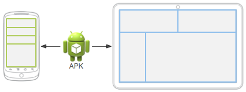

<https://developer.android.com/guide/>

# Application Fundamentals

Android apps can be written using **Kotlin, Java, and C++ languages**. The Android SDK tools compile your code along with any data and resource files into an APK, an *Android package*, which is an archive file with an `.apk` suffix. One APK file contains all the contents of an Android app and is the file that Android-powered devices use to install the app.

Each Android app lives in its own **security sandbox**, protected by the following **Android security features**:

- The Android operating system is a **multi-user Linux system** in which **each app is a different user**.
- By default, the system assigns each **app a unique Linux user ID** . The system **sets permissions for all the files** in an app so that only the user ID assigned to that app can access them.
- **Each process has its own virtual machine (VM)**, so an app's code runs in isolation from other apps.
- By default, every app runs in its own Linux process. The Android system starts the process when any of the app's components need to be executed

The Android system implements the ***principle of least privilege***. That is, each app, by default, has access only to the components that it requires to do its work and no more. This creates a very secure environment in which an app cannot access parts of the system for which it is not given permission. However, there are ways for an app to share data with other apps and for an app to access system services:

- It's **possible to arrange for two apps to share the same Linux user ID**, in which case they are able to access each other's files. To conserve system resources, apps with the same user ID can also arrange to run in the same Linux process and share the same VM. The apps must also be signed with the same certificate.
- An app can request permission to access device data such as the user's contacts, SMS messages, the mountable storage (SD card), camera, and Bluetooth. The user has to explicitly grant these permissions.

The rest of this document introduces the following concepts:

- **The core framework components** that **define your app**.
- **The manifest file** in which you **declare the components and the required device features** for your app.
- **Resources** that are separate from the app code and that allow your app to gracefully optimize its behavior for a variety of device configurations.

## App components

App components are the essential building blocks of an Android app. Each component is **an entry point** through which the system or a user can enter your app. Some components depend on others.

There are four different types of app components:

### Activities

### Services

### Broadcast receivers

### Content providers

Each type serves a distinct **purpose** and has a distinct **lifecycle** that defines how the component is created and destroyed.

- **Activities**

    An *activity* is **the entry point for interacting with the user**. It represents **a single screen with a user interface**. For example, an email app might have one activity that shows a list of new emails, another activity to compose an email, and another activity for reading emails. Although the activities work together to form a cohesive user experience in the email app, each one is independent of the others. As such, a different app can start any one of these activities if the email app allows it. For example, a camera app can start the activity in the email app that composes new mail to allow the user to share a picture. An activity facilitates the following **key interactions** between system and app:**Keeping track** of what the user currently cares about (**what is on screen**) to ensure that the system keeps running the process that is hosting the activity.**Knowing that previously used processes contain things the user may return to (stopped activities)**, and thus more highly prioritize keeping those processes around. **Helping** the app handle having its process killed so the user can return to activities with their previous state restored.**Providing** a way for apps to implement user flows between each other, and for the system to coordinate these flows. (The most classic example here being share.)You implement an activity as a subclass of the `Activity` class.

- **Services**

    A *service* is **a general-purpose entry point for keeping an app running in the background**. It is a component that runs in the background to perform **long-running operations** or to **perform work for remote processes**. A service does not provide a user interface. 

    For example, a service might play music in the background while the user is in a different app, or it might fetch data over the network without blocking user interaction with an activity. Another component, such as an activity, can start the service and let it run or bind to it in order to interact with it. There are actually two very distinct semantics services tell the system about how to manage an app: Started services tell the system to keep them running until their work is completed. This could be to sync some data in the background or play music even after the user leaves the app. Syncing data in the background or playing music also represent two different types of started services that modify how the system handles them:

    - Music playback is something the user is directly aware of, so the app tells the system this by saying it wants to be foreground with a notification to tell the user about it; in this case the system knows that it should try really hard to keep that service's process running, because the user will be unhappy if it goes away.

    - A regular background service is not something the user is directly aware as running, so the system has more freedom in managing its process. It may allow it to be killed (and then restarting the service sometime later) if it needs RAM for things that are of more immediate concern to the user.

    **Bound services** run because some other app (or the system) has said that it wants to make use of the service. This is basically the service providing an API to another process. The system thus knows there is a dependency between these processes, so if process A is bound to a service in process B, it knows that it needs to keep process B (and its service) running for A. Further, if process A is something the user cares about, then it also knows to treat process B as something the user also cares about. Because of their flexibility (for better or worse), services have turned out to be a really useful building block for all kinds of higher-level system concepts. Live wallpapers, notification listeners, screen savers, input methods, accessibility services, and many other core system features are all built as services that applications implement and the system binds to when they should be running.A service is implemented as a subclass of `Service`. 

    **Note:** If your app targets Android 5.0 (API level 21) or later, use the `JobScheduler` class to schedule actions. JobScheduler has the advantage of conserving battery by optimally scheduling jobs to reduce power consumption, and by working with the Doze API. For more information about using this class, see the `JobScheduler` reference documentation.

- **Broadcast receivers**

    A *broadcast receiver* is a component that enables the system to deliver events to the app outside of a regular user flow, allowing the app to respond to system-wide broadcast announcements. Because broadcast receivers are another well-defined entry into the app, the system can deliver broadcasts even to apps that aren't currently running. 

    So, for example, an app can schedule an alarm to post a notification to tell the user about an upcoming event... and by delivering that alarm to a BroadcastReceiver of the app, there is no need for the app to remain running until the alarm goes off. Many broadcasts originate from the system—for example, a broadcast announcing that the screen has turned off, the battery is low, or a picture was captured. Apps can also initiate broadcasts—for example, to let other apps know that some data has been downloaded to the device and is available for them to use. Although broadcast receivers don't display a user interface, they may *create a status bar notification* to alert the user when a broadcast event occurs. 

    More commonly, though, a broadcast receiver is just a **gateway** to other components and is intended to do a very minimal amount of work. For instance, it might schedule a `JobService`to perform some work based on the event with `JobScheduler`A broadcast receiver is implemented as a subclass of `BroadcastReceiver` and each broadcast is delivered as an `Intent` object. For more information, see the `BroadcastReceiver` class.

- **Content providers**

    A *content provider* manages a shared set of app data that you can store in the file system, in a SQLite database, on the web, or on any other persistent storage location that your app can access. Through the content provider, other apps can query or modify the data if the content provider allows it. 

    For example, the Android system provides a content provider that manages the user's contact information. As such, any app with the proper permissions can query the content provider, such as `ContactsContract.Data`, to read and write information about a particular person. 

    It is tempting to think of a content provider as **an abstraction on a database**, because there is a lot of API and support built in to them for that common case. However, they have a different core purpose from a system-design perspective. To the system, a content provider is an entry point into an app for publishing named data items, identified by a URI scheme. Thus an app can decide how it wants to map the data it contains to a URI namespace, handing out those URIs to other entities which can in turn use them to access the data. There are a few particular things this allows the system to do in managing an app:

    - Assigning a URI doesn't require that the app remain running, so URIs can persist after their owning apps have exited. The system only needs to make sure that an owning app is still running when it has to retrieve the app's data from the corresponding URI.

    - These URIs also provide an important fine-grained security model. For example, an app can place the URI for an image it has on the clipboard, but leave its content provider locked up so that other apps cannot freely access it. When a second app attempts to access that URI on the clipboard,the system can allow that app to access the data via a temporary *URI permission grant* so that it is allowed to access the data only behind that URI, but nothing else in the second app.

    Content providers are also useful for reading and writing data that is private to your app and not shared. A content provider is implemented as a subclass of `ContentProvider` and must implement a standard set of APIs that enable other apps to perform transactions. 

A unique aspect of the Android system design is that any app can start another app’s component. For example, if you want the user to capture a photo with the device camera, there's probably another app that does that and your app can use it instead of developing an activity to capture a photo yourself. You don't need to incorporate or even link to the code from the camera app. Instead, you can simply start the activity in the camera app that captures a photo. When complete, the photo is even returned to your app so you can use it. To the user, it seems as if the camera is actually a part of your app.

When the system starts a component, it starts the process for that app if it's not already running and instantiates the classes needed for the component. For example, if your app starts the activity in the camera app that captures a photo, that activity runs in the process that belongs to the camera app, not in your app's process. Therefore, unlike apps on most other systems, Android apps don't have a single entry point (there's no `main()` function).

Because the system runs each app in a separate process with file permissions that restrict access to other apps, your app cannot directly activate a component from another app. However, the Android system can. To activate a component in another app, deliver a message to the system that specifies your *intent* to start a particular component. The system then activates the component for you.

## Activating components

Three of the four component types—activities, services, and broadcast receivers—are activated by an asynchronous message called an *intent*. Intents bind individual components to each other at runtime. You can think of them as the messengers that request an action from other components, whether the component belongs to your app or another.

An intent is created with an `Intent` object, which defines a message to activate either a specific component (explicit intent) or a specific *type* of component (implicit intent).

For activities and services, an intent defines the **action to perform** (for example, to *view* or *send* something) and may **specify the URI of the data to act on**, among other things that the component being started might need to know. For example, an intent might convey a request for an activity to show an image or to open a web page. In some cases, you can start an activity to receive a result, in which case the activity also returns the result in an `Intent`. For example, you can issue an intent to let the user pick a personal contact and have it returned to you. The return intent includes a URI pointing to the chosen contact.

For broadcast receivers, the intent simply defines the announcement being broadcast. For example, a broadcast to indicate the device battery is low includes only a known action string that indicates *battery is low*.

Unlike activities, services, and broadcast receivers, content providers are not activated by intents. Rather, they are activated when targeted by a request from a `ContentResolver`. The content resolver handles all direct transactions with the content provider so that the component that's performing transactions with the provider doesn't need to and instead calls methods on the `ContentResolver` object. This leaves a layer of abstraction between the content provider and the component requesting information (for security).

There are separate methods for activating each type of component:

- You can start an activity or give it something new to do by passing an `Intent` to `startActivity()` or `startActivityForResult()` (when you want the activity to return a result).
- With Android 5.0 (API level 21) and later, you can use the `JobScheduler` class to schedule actions. For earlier Android versions, you can start a service (or give new instructions to an ongoing service) by passing an `Intent` to `startService()`. You can bind to the service by passing an `Intent` to `bindService()`.
- You can initiate a broadcast by passing an `Intent` to methods such as `sendBroadcast()`, `sendOrderedBroadcast()`, or `sendStickyBroadcast()`.
- You can perform a query to a content provider by calling `query()` on a `ContentResolver`.

## The manifest file

**Before the Android system can start an app component, the system must know that the component exists by reading the app's *manifest file*, `AndroidManifest.xml`.** Your app must declare all its components in this file, which must be at the root of the app project directory.

The manifest does a number of things in addition to declaring the app's components, such as the following:

- Identifies any user permissions the app requires, such as Internet access or read-access to the user's contacts.
- Declares the minimum [API Level](https://developer.android.com/guide/topics/manifest/uses-sdk-element.html#ApiLevels) required by the app, based on which APIs the app uses.
- Declares hardware and software features used or required by the app, such as a camera, bluetooth services, or a multitouch screen.
- Declares API libraries the app needs to be linked against (other than the Android framework APIs), such as the [Google Maps library](http://code.google.com/android/add-ons/google-apis/maps-overview.html).

### Declaring components

The primary task of the manifest is to inform the system about the app's components. For example, a manifest file can declare an activity as follows:

```xml
<?xml version="1.0" encoding="utf-8"?>
<manifest ... >
    <application android:icon="@drawable/app_icon.png" ... >
        <activity android:name="com.example.project.ExampleActivity"
                  android:label="@string/example_label" ... >
        </activity>
        ...
    </application>
</manifest>
```


In the `<application>` element, the `android:icon` attribute points to resources for an icon that identifies the app.

In the `<activity>` element, the `android:name` attribute specifies the fully qualified class name of the `Activity`subclass and the `android:label` attribute specifies a string to use as the user-visible label for the activity.

You must declare all app components using the following elements:

- `<activity>` elements for activities.
- `<service>` elements for services.
- `<receiver>` elements for broadcast receivers.
- `<provider>` elements for content providers.

Activities, services, and content providers that you include in your source but do not declare in the manifest are not visible to the system and, consequently, can never run. **However, broadcast receivers can be either declared in the manifest or created dynamically in code as `BroadcastReceiver` objects and registered with the system by calling`registerReceiver()`.**

### Declaring component capabilities

The system identifies the components that can respond to an intent by comparing the intent received to the *intent filters* provided in the manifest file of other apps on the device.

When you declare an activity in your app's manifest, you can optionally include intent filters that declare **the capabilities of the activity** so it **can respond to intents from other apps**. You can declare an intent filter for your component by adding an `intent filter` element as a child of the component's declaration element.

For example, if you build an email app with an activity for composing a new email, you can declare an intent filter to respond to "send" intents (in order to send a new email), as shown in the following example:

```xml
<manifest ... >
    ...
    <application ... >
        <activity android:name="com.example.project.ComposeEmailActivity">
            <intent-filter>
                <action android:name="android.intent.action.SEND" />
                <data android:type="*/*" />
                <category android:name="android.intent.category.DEFAULT" />
            </intent-filter>
        </activity>
    </application>
</manifest>
```


If another app creates an intent with the `ACTION_SEND` action and passes it to `startActivity()`, the system may start your activity so the user can draft and send an email.

### Declaring app requirements

There are a variety of devices powered by Android and not all of them provide the same features and capabilities. To prevent your app from being installed on devices that lack features needed by your app, it's important that you clearly define a **profile** for **the types of devices** your app supports by declaring device and software requirements in your manifest file. Most of these declarations are informational only and the system does not read them, but external services such as Google Play do read them in order to provide filtering for users when they search for apps from their device.

For example, if your app requires a camera and uses APIs introduced in Android 2.1 (**API Level** 7), you must declare these as requirements in your manifest file as shown in the following example:

```xml
<manifest ... >
    <uses-feature android:name="android.hardware.camera.any"
                  android:required="true" />
    <uses-sdk android:minSdkVersion="7" android:targetSdkVersion="19" />
    ...
</manifest>
```


With the declarations shown in the example, devices that do *not* have a camera or have an Android version *lower* than 2.1 cannot install your app from Google Play. However, you can declare that your app uses the camera, but does not *require* it. In that case, your app must set the [`required`](https://developer.android.com/guide/topics/manifest/uses-feature-element.html#required) attribute to `false` and check at runtime whether the device has a camera and disable any camera features as appropriate.

## App resources

An Android app is composed of more than just code—it requires resources that are separate from the source code, such as images, audio files, and **anything relating to the visual presentation of the app**. 

For example, you can define **animations, menus, styles, colors, and the layout of activity user interfaces with XML files**. Using app resources makes it easy to update various characteristics of your app without modifying code. Providing sets of alternative resources enables you to optimize your app for a variety of device configurations, such as different languages and screen sizes.

For every resource that you include in your Android project, the SDK build tools define a **unique integer ID**, which you can use to reference the resource from your app code or from other resources defined in XML. 

For example, if your app contains an image file named `logo.png` (saved in the `res/drawable/` directory), the SDK tools generate a resource ID named `R.drawable.logo`. This ID maps to an app-specific integer, which you can use to reference the image and insert it in your user interface.

One of the most important aspects of providing resources separate from your source code is the ability to **provide alternative resources for different device configurations**. For example, by defining UI strings in XML, you can translate the strings into other languages and save those strings in separate files. Then Android applies the appropriate language strings to your UI based on a language **qualifier** that you append to the resource directory's name (such as `res/values-fr/` for French string values) and the user's language setting.

# App resources

<https://developer.android.com/guide/topics/resources/providing-resources>

## overview

Resources are the additional files and static content that your code uses, such as bitmaps, layout definitions, user interface strings, animation instructions, and more.

You should always externalize app resources such as images and strings from your code, so that you can maintain them independently. You should also provide alternative resources for specific device configurations, by grouping them in specially-named resource directories. At runtime, Android uses the appropriate resource based on the current configuration. For example, you might want to provide a different UI layout depending on the screen size or different strings depending on the language setting.

Once you externalize your app resources, you can access them using resource IDs that are generated in your project's `R`class

### Grouping resource types

You should place each type of resource in a specific subdirectory of your project's `res/` directory. For example, here's the file hierarchy for a simple project:

```
MyProject/
    src/
        MyActivity.java
    res/
        drawable/
            graphic.png
        layout/
            main.xml
            info.xml
        mipmap/
            icon.png
        values/
            strings.xml
```


As you can see in this example, the `res/` directory contains all the resources (in subdirectories): an image resource, two layout resources, `mipmap/` directories for launcher icons, and a string resource file. 

The resources that you save in the subdirectories defined above are your "default" resources. That is, these resources define the default design and content for your app. However, different types of Android-powered devices might call for different types of resources.

For example, if a device has a larger than normal screen, then you should provide different layout resources that take advantage of the extra screen space. Or, if a device has a different language setting, then you should provide different string resources that translate the text in your user interface. 

To provide these different resources for different device configurations, you need to provide alternative resources, in addition to your default resources.

### Providing alternative resources

Almost every app should provide alternative resources to support specific device configurations. For instance, you should include alternative drawable resources for different screen densities and alternative string resources for different languages. At runtime, Android detects the current device configuration and loads the appropriate resources for your app.




To specify configuration-specific alternatives for a set of resources:

1. Create a new directory in `res/` named in the form `<resources_name>-<config_qualifier>`. 
    - *<resources_name>* is the directory name of the corresponding default resources (defined in table 1).
    - *<qualifier>* is a name that specifies an individual configuration for which these resources are to be used (defined in table 2).

    You can append more than one *<qualifier>*. Separate each one with a dash.

    **Caution:** When appending multiple qualifiers, you must place them in the same order in which they are listed in table 2. If the qualifiers are ordered wrong, the resources are ignored.

2. Save the respective alternative resources in this new directory. The resource files must be named exactly the same as the default resource files.

For example, here are some default and alternative resources:

```
res/
    drawable/
        icon.png
        background.png
    drawable-hdpi/
        icon.png
        background.png
```

The `hdpi` qualifier indicates that the resources in that directory are for devices with a high-density screen. The images in each of these drawable directories are sized for a specific screen density, but the filenames are exactly the same. This way, the resource ID that you use to reference the `icon.png` or `background.png` image is always the same, but Android selects the version of each resource that best matches the current device, by comparing the device configuration information with the qualifiers in the resource directory name.

#### Qualifier name rules

Here are some rules about using configuration qualifier names:

- You can specify multiple qualifiers for a single set of resources, separated by dashes. For example, `drawable-en-rUS-land` applies to US-English devices in landscape orientation.

- The qualifiers must be in the order listed in `qulifier table`

    . For example:

    - Wrong: `drawable-hdpi-port/`
    - Correct: `drawable-port-hdpi/`

- Alternative resource directories cannot be nested. For example, you cannot have `res/drawable/drawable-en/`.

- Values are **case-insensitive**. The resource compiler converts directory names to lower case before processing to avoid problems on case-insensitive file systems. Any capitalization in the names is only to benefit readability.

- Only one value for each qualifier type is supported. For example, if you want to use the same drawable files for Spain and France, you *cannot* have a directory named `drawable-rES-rFR/`. Instead you need two resource directories, such as `drawable-rES/` and `drawable-rFR/`, which contain the appropriate files. However, you aren't required to actually duplicate the same files in both locations. Instead, you can create an alias to a resource. 

After you save alternative resources into directories named with these qualifiers, Android automatically applies the resources in your app based on the current **device configuration**. Each time a resource is requested, Android checks for alternative resource directories that contain the requested resource file, then **finds the best-matching resource**. If there are **no alternative resources that match a particular device configuration, then Android uses the corresponding default resources** (the set of resources for a particular resource type that doesn't include a configuration qualifier).

#### Creating alias resources

When you have a resource that you'd like to use for more than one device configuration (but don't want to provide as a default resource), you don't need to put the same resource in more than one alternative resource directory. Instead, you can (in some cases) create an alternative resource that acts as an alias for a resource saved in your default resource directory.

**Note:** Not all resources offer a mechanism by which you can create an alias to another resource. In particular, animation, menu, raw, and other unspecified resources in the `xml/` directory don't offer this feature.

For example, imagine you have an app icon, `icon.png`, and need unique version of it for different locales. However, two locales, English-Canadian and French-Canadian, need to use the same version. You might assume that you need to copy the same image into the resource directory for both English-Canadian and French-Canadian, but it's not true. Instead, you can save the image that's used for both as `icon_ca.png` (any name other than `icon.png`) and put it in the default `res/drawable/` directory. Then create an `icon.xml` file in `res/drawable-en-rCA/` and `res/drawable-fr-rCA/` that refers to the `icon_ca.png` resource using the `<bitmap>` element. This allows you to store just one version of the PNG file and two small XML files that point to it. (An example XML file is shown below.)

Drawable

To create an alias to an existing drawable, use the `<drawable>` element. For example:

```xml
<?xml version="1.0" encoding="utf-8"?>
<resources>
    <drawable name="icon">@drawable/icon_ca</drawable>
</resources>
```


If you save this file as `drawables.xml` (in an alternative resource directory, such as `res/values-en-rCA/`), it is compiled into a resource that you can reference as `R.drawable.icon`, but is actually an alias for the `R.drawable.icon_ca` resource (which is saved in `res/drawable/`).

Layout

To create an alias to an existing layout, use the `<include>` element, wrapped in a `<merge>`. For example:

```xml
<?xml version="1.0" encoding="utf-8"?>
<merge>
    <include layout="@layout/main_ltr"/>
</merge>
```


If you save this file as `main.xml`, it is compiled into a resource you can reference as `R.layout.main`, but is actually an alias for the `R.layout.main_ltr` resource.

Strings and other simple values

To create an alias to an existing string, simply use the resource ID of the desired string as the value for the new string. For example:

```xml
<?xml version="1.0" encoding="utf-8"?>
<resources>
    <string name="hello">Hello</string>
    <string name="hi">@string/hello</string>
</resources>
```


The `R.string.hi` resource is now an alias for the `R.string.hello`.

Other simple values work the same way. For example, a color:

```xml
<?xml version="1.0" encoding="utf-8"?>
<resources>
    <color name="red">#f00</color>
    <color name="highlight">@color/red</color>
</resources>
```

### Accessing your app resources

Once you provide a resource in your application, you can apply it by referencing its resource ID. All resource IDs are defined in your project's **`R` class, which the `aapt` tool automatically generates**.

When your application is compiled, `aapt` generates the `R` class, which contains resource IDs for all the resources in your `res/` directory. For each type of resource, there is an `R` subclass (for example, `R.drawable` for all drawable resources), and for each resource of that type, there is a static integer (for example, `R.drawable.icon`). This integer is the resource ID that you can use to retrieve your resource.

Although the `R` class is where resource IDs are specified, you should never need to look there to discover a resource ID. A resource ID is always composed of:

- The *resource type*: Each resource is grouped into a "type," such as `string`, `drawable`, and `layout`. 
- The *resource name*, which is either: the filename, excluding the extension; or the value in the XML `android:name`attribute, if the resource is a simple value (such as a string).

There are two ways you can access a resource:

- In code: Using a static integer from a sub-class of your `R` class, such as:

    ```java
    R.string.hello
    ```

    `string` is the resource type and `hello` is the resource name. There are many Android APIs that can access your resources when you provide a resource ID in this format

- In XML: Using a special XML syntax that also corresponds to the resource ID defined in your `R` class, such as:

    ```xml
    @string/hello
    ```

    `string` is the resource type and `hello` is the resource name. You can use this syntax in an XML resource any place where a value is expected that you provide in a resource

#### Accessing resources in code

You can use a resource in code by passing the resource ID as a method parameter. For example, you can set an `ImageView` to use the `res/drawable/myimage.png` resource using `setImageResource()`:

```java
ImageView imageView = (ImageView) findViewById(R.id.myimageview);
imageView.setImageResource(R.drawable.myimage);
```

Syntax

Here's the syntax to reference a resource in code:

```
[<package_name>.]R.<resource_type>.<resource_name>
```

- *<package_name>* is the name of the package in which the resource is located (**not required when referencing resources from your own package**).
- *<resource_type>* is the `R` subclass for the resource type.
- *<resource_name>* is either the resource filename without the extension or the `android:name` attribute value in the XML element (for simple values).

**Use cases**

There are many methods that accept a resource ID parameter and you can retrieve resources using methods in `Resources`. You can get an instance of `Resources` with `Context.getResources()`.

Here are some examples of accessing resources in code:

```java
// Load a background for the current screen from a drawable resource
getWindow().setBackgroundDrawableResource(R.drawable.my_background_image) ;

// Set the Activity title by getting a string from the Resources object, because
//  this method requires a CharSequence rather than a resource ID
getWindow().setTitle(getResources().getText(R.string.main_title));

// Load a custom layout for the current screen
setContentView(R.layout.main_screen);

// Set a slide in animation by getting an Animation from the Resources object
flipper.setInAnimation(AnimationUtils.loadAnimation(this,
        R.anim.hyperspace_in));

// Set the text on a TextView object using a resource ID
TextView msgTextView = (TextView) findViewById(R.id.msg);
msgTextView.setText(R.string.hello_message);
```

**Caution:** You should never modify the `R.java` file by hand—it is generated by the `aapt` tool when your project is compiled. Any changes are overridden next time you compile.

#### Accessing resources from XML

You can define values for some XML attributes and elements using a reference to an existing resource. You will often do this when creating layout files, to supply strings and images for your widgets.

For example, if you add a `Button` to your layout, you should use a string resource for the button text:

```xml
<Button
    android:layout_width="fill_parent"
    android:layout_height="wrap_content"
    android:text="@string/submit" />
```

**Use cases**

In some cases you must use a resource for a value in XML (for example, to apply a drawable image to a widget), but you can also use a resource in XML any place that accepts a simple value. For example, if you have the following resource file that includes a color resource and a string resource:

```xml
<?xml version="1.0" encoding="utf-8"?>
<resources>
   <color name="opaque_red">#f00</color>
   <string name="hello">Hello!</string>
</resources>
```


You can use these resources in the following layout file to set the text color and text string:

```xml
<?xml version="1.0" encoding="utf-8"?>
<EditText xmlns:android="http://schemas.android.com/apk/res/android"
    android:layout_width="fill_parent"
    android:layout_height="fill_parent"
    android:textColor="@color/opaque_red"
    android:text="@string/hello" />
```


In this case you don't need to specify the package name in the resource reference because the resources are from your own package. To reference a **system resource**, you would need to include the package name. For example:

```xml
<?xml version="1.0" encoding="utf-8"?>
<EditText xmlns:android="http://schemas.android.com/apk/res/android"
    android:layout_width="fill_parent"
    android:layout_height="fill_parent"
    android:textColor="@android:color/secondary_text_dark"
    android:text="@string/hello" />
```


**Note:** You should use string resources at all times, so that your application can be localized for other languages. For information about creating alternative resources (such as localized strings)

##### Referencing style attributes

A style attribute resource allows you to reference the value of an attribute in the currently-applied theme. Referencing a style attribute allows you to **customize the look of UI elements by styling them to match standard variations supplied by the current theme**, instead of supplying a hard-coded value. Referencing a style attribute essentially says, "use the style that is defined by this attribute, in the current theme."

To reference a style attribute, the name syntax is almost identical to the normal resource format, but instead of the at-symbol (`@`), use a question-mark (`?`), and the resource type portion is optional. For instance:

```
?[<package_name>:][<resource_type>/]<resource_name>
```


For example, here's how you can reference an attribute to set the text color to match the "primary" text color of the system theme:

```xml
<EditText id="text"    android:layout_width="fill_parent"    android:layout_height="wrap_content"    android:textColor="**?android:textColorSecondary**"    android:text="@string/hello_world" />
```

#### Accessing original files

While uncommon, you might need access your original files and directories. If you do, then saving your files in `res/`won't work for you, because the only way to read a resource from `res/` is with the resource ID. Instead, you can save your resources in the `assets/` directory.

**Files saved in the `assets/` directory are *not* given a resource ID**, so you can't reference them through the `R` class or from XML resources. Instead, you can query files in the `assets/` directory like a normal file system and read raw data using `AssetManager`.

However, if all you require is the ability to read raw data (such as a video or audio file), then save the file in the `res/raw/`directory and read a stream of bytes using `openRawResource()`.

#### Accessing platform resources

Android contains a number of standard resources, such as styles, themes, and layouts. To access these resource, qualify your resource reference with the `android` package name. For example, Android provides a layout resource you can use for list items in a `ListAdapter`:

```java
setListAdapter(new ArrayAdapter<String>(this, android.R.layout.simple_list_item_1, myarray));
```

In this example, `simple_list_item_1` is a layout resource defined by the platform for items in a `ListView`. You can use this instead of creating your own layout for list items.

### finds the best-matching resource

<https://developer.android.com/guide/topics/resources/providing-resources#BestMatch>

# App Manifest Overview

`AndroidManifest.xml`

Every app project must have an AndroidManifest.xml file (with precisely that name) at the root of the project source set. The manifest file describes essential information about your app to the Android build tools, the Android operating system, and Google Play.

Among many other things, the manifest file is required to declare the following:

- The app's package name, which usually matches your code's namespace.
- The components of the app, which include all activities, services, broadcast receivers, and content providers. Each component must define basic properties such as the name of its Kotlin or Java class. It can also declare capabilities such as which device configurations it can handle, and intent filters that describe how the component can be started
- The permissions that the app needs in order to access protected parts of the system or other apps. It also declares any permissions that other apps must have if they want to access content from this app
- The hardware and software features the app requires, which affects which devices can install the app from Google Play.

## File features

The following sections describe how some of the most important characteristics of your app are reflected in the manifest file.

### Package name and application ID

The manifest file's root element requires an attribute for your app's package name (usually matching your project directory structure—the Java namespace).

For example, the following snippet shows the root `manifest` element with the package name `com.example.myapp`:

```xml
<?xml version="1.0" encoding="utf-8"?>
<manifest xmlns:android="http://schemas.android.com/apk/res/android"
    package="com.example.myapp"
    android:versionCode="1"
    android:versionName="1.0" >

    <application
        android:allowBackup="true"
        android:icon="@mipmap/ic_launcher"
        android:label="@string/app_name"
        android:roundIcon="@mipmap/ic_launcher_round"
        android:supportsRtl="true"
        android:theme="@style/AppTheme"
        tools:ignore="GoogleAppIndexingWarning">
        <activity android:name=".MainActivity" >
            <intent-filter>
                <action android:name="android.intent.action.MAIN" />

                <category android:name="android.intent.category.LAUNCHER" />
            </intent-filter>
        </activity>
    </application>

</manifest>
```

While building your app into the final application package (APK), the Android build tools use the `package` attribute for two things:

- It applies this name as the namespace for your app's generated `R.java` class (used to access your app resources).

    Example: With the above manifest, the `R` class is created at `com.example.myapp.R`.

- It uses this name to resolve any relative class names that are declared in the manifest file.

    Example: With the above manifest, an activity declared as `<activity android:name=".MainActivity">` is resolved to be `com.example.myapp.MainActivity`.

### App components

For each [app component](https://developer.android.com/guide/components/fundamentals.html#Components) that you create in your app, you must declare a corresponding XML element in the manifest file:

- `<activity>` for each subclass of `Activity`.
- `<service>` for each subclass of `Service`.
- `<receiver>` for each subclass of `BroadcastReceiver`.
- `<provider>` for each subclass of `ContentProvider`.

If you subclass any of these components without declaring it in the manifest file, the system cannot start it.

The name of your subclass must be specified with the `name` attribute, using the full package designation. For example, an `Activity` subclass can be declared as follows:

```xml
<manifest ... >
    <application ... >
        <activity android:name="com.example.myapp.MainActivity" ... >
        </activity>
    </application>
</manifest>
```

### Permissions

Android apps must request permission to access sensitive user data (such as contacts and SMS) or certain system features (such as the camera and internet access). Each permission is identified by a unique label. For example, an app that needs to send SMS messages must have the following line in the manifest:

```xml
<manifest ... >
    <uses-permission android:name="android.permission.SEND_SMS"/>
    ...
</manifest>
```


Beginning with Android 6.0 (API level 23), the user can approve or reject some app permisions at runtime. But no matter which Android version your app supports, you must declare all permission requests with a `<uses-permission>` element in the manifest. If the permission is granted, the app is able to use the protected features. If not, its attempts to access those features fail.

### Device compatibility

The manifest file is also where you can declare what types of hardware or software features your app requires, and thus, which types of devices your app is compatible with. Google Play Store does not allow your app to be installed on devices that don't provide the features or system version that your app requires.

There are several manifest tags that define which devices your app is compatible with. The following are just a couple of the most common tags.

`<uses-feature>`

The uses-features element allows you to declare hardware and software features your app needs. For example, if your app cannot achieve basic functionality on a device without a compass sensor, you can declare the compass sensor as required with the following manifest tag:

```xml
<manifest ... >
    <uses-feature android:name="android.hardware.sensor.compass"
                  android:required="true" />
    ...
</manifest>
```

`<uses-sdk>`

Each successive platform version often adds new APIs not available in the previous version. To indicate the minimum version with which your app is compatible, your manifest must include the [``](https://developer.android.com/guide/topics/manifest/uses-sdk-element.html) tag and its `minSdkVersion`attribute.

**However, beware that attributes in the `uses-sdk` element are overridden by corresponding properties in the [`build.gradle`](https://developer.android.com/studio/build/index.html#build-files) file**. So if you're using Android Studio, you must specify the `minSdkVersion` and `targetSdkVersion`values there instead:

```groovy
android {
  defaultConfig {
    applicationId 'com.example.myapp'

    // Defines the minimum API level required to run the app.
    minSdkVersion 15

    // Specifies the API level used to test the app.
    targetSdkVersion 28

    ...
  }
}
```


# core topic

## doze and app-standby

<https://developer.android.com/training/monitoring-device-state/doze-standby.html>

**Optimize for Doze and App Standby**

Starting from Android 6.0 (API level 23), Android introduces two power-saving features that extend battery life for users by managing how apps behave when a device is not connected to a power source. Doze reduces battery consumption by deferring background CPU and network activity for apps when the device is unused for long periods of time. App Standby defers background network activity for apps with which the user has not recently interacted.

## Intents and Intent Filters

<https://developer.android.com/guide/components/intents-filters.html>

An Intent is a **messaging object** you can use to request an action from another app component. Although intents facilitate communication between components in several ways, there are three fundamental use cases: `activity, service, broadcast`

### Intent types

There are two types of intents:

- **Explicit intents** specify which application will satisfy the intent, by supplying either the target app's package name or a fully-qualified component class name. You'll typically use an explicit intent to start a component in your own app, because you know the class name of the activity or service you want to start
- **Implicit intents** do not name a specific component, but instead declare a general action to perform, which allows a component from another app to handle it. For example, if you want to show the user a location on a map, you can use an implicit intent to request that another capable app show a specified location on a map.

When the `Intent` object names a specific activity component explicitly, the system immediately starts that component.

When you use an implicit intent, the Android system finds the appropriate component to start by comparing the contents of the intent to the *intent filters* declared in the `manifest file` of other apps on the device. If the intent matches an **intent filter**, the system starts that component and delivers it the `Intent` object. **If multiple intent filters are compatible, the system displays a dialog so the user can pick which app to use**.

**An `intent filter` is an expression in an app's manifest file** that specifies the type of intents that the component would like to receive. For instance, by declaring an intent filter for an activity, you make it possible for other apps to directly start your activity with a certain kind of intent. Likewise, if you do *not* declare any intent filters for an activity, then it can be started only with an explicit intent.


How an implicit intent is delivered through the system to start another activity: 

**[1]** *Activity A* creates an `Intent` with an action description and passes it to `startActivity()`. 
**[2]** The Android System searches all apps for an intent filter that matches the intent. When a match is found, 
**[3]** the system starts the matching activity (*Activity B*) by invoking its `onCreate()` method and passing it the `Intent`.

**Caution:** To ensure that your app is secure, always use an explicit intent when starting a `Service` and do not declare intent filters for your services.

### Building an intent

The primary information contained in an `Intent` is the following:

- **Component name**

    The name of the component to start.This is optional, but it's the critical piece of information that makes an intent *explicit*, meaning that the intent should be delivered only to the app component defined by the component name. Without a component name, the intent is *implicit*, 

    fully qualified class name of the target component, including the package name of the app, for example, `com.example.ExampleActivity`

- **Action**

    **A string** that specifies the generic action to perform

    You can specify your own actions for use by intents within your app (or for use by other apps to invoke components in your app), but you usually specify action constants defined by the `Intent` class or other framework classes. Here are some common actions for starting an activity:

    - `ACTION_VIEW`

        Use this action in an intent with `startActivity()` when you have some information that an activity can show to the user, such as a photo to view in a gallery app

    - `ACTION_SEND`

        Also known as the *share* intent, you should use this in an intent with `startActivity()` when you have some data that the user can share through another app, such as an email app or social sharing app.

    If you define your own actions, be sure to include your **app's package name as a prefix**, as shown in the following example:

    ```java
    static final String ACTION_TIMETRAVEL = "com.example.action.TIMETRAVEL";
    ```

 - **Data**

    When creating an intent, it's often important to specify **the type of data (its MIME type)** in addition to its URI. 

    For example, an activity that's able to display images probably won't be able to play an audio file, even though the URI formats could be similar. Specifying the MIME type of your data helps the Android system find the best component to receive your intent. However, the MIME type can sometimes be inferred from the URI—particularly when the data is a `content:` URI. A `content:` URI indicates the data is located on the device and controlled by a`ContentProvider`, which makes the data MIME type visible to the system.

    To set only the data URI, call `setData()`. To set only the MIME type, call `setType()`. If necessary, you can set both explicitly with `setDataAndType()`.

    **Caution:** If you want to set both the URI and MIME type, *don't* call `setData()` and `setType()` because they each nullify the value of the other. **Always use `setDataAndType()` to set both URI and MIME type**.

- **Extras**

    Key-value pairs that carry additional information required to accomplish the requested action. Just as some actions use particular kinds of data URIs, some actions also use particular extras.

    You can add extra data with various `putExtra()` methods, each accepting two parameters: the key name and the value. You can also create a `Bundle` object with all the extra data, then insert the `Bundle` in the `Intent` with `putExtras()`.

    For example, when creating an intent to send an email with `ACTION_SEND`, you can specify the *to* recipient with the`EXTRA_EMAIL` key, and specify the *subject* with the `EXTRA_SUBJECT` key.

    The `Intent` class specifies many `EXTRA_*` constants for standardized data types. If you need to declare your own extra keys (for intents that your app receives), be sure to include your **app's package name as a prefix**, as shown in the following example:

    ```java
    static final String EXTRA_GIGAWATTS = "com.example.EXTRA_GIGAWATTS";
    ```

### explicit intent

An explicit intent is one that you use to launch a specific app component, such as a particular activity or service in your app. To create an explicit intent, define the component name for the `Intent` object—all other intent properties are optional.

For example, if you built a service in your app, named `DownloadService`, designed to download a file from the web, you can start it with the following code:

```java
// Executed in an Activity, so 'this' is the Context
// The fileUrl is a string URL, such as "http://www.example.com/image.png"
Intent downloadIntent = new Intent(this, DownloadService.class);
downloadIntent.setData(Uri.parse(fileUrl));
startService(downloadIntent);
```

The `Intent(Context, Class)` constructor supplies the app `Context` and the component a `Class` object. As such, this intent explicitly starts the `DownloadService` class in the app.

### implicit intent

An implicit intent specifies an action that can invoke any app on the device able to perform the action. Using an implicit intent is useful when your app cannot perform the action, but other apps probably can and you'd like the user to pick which app to use.

For example, if you have content that you want the user to share with other people, create an intent with the `ACTION_SEND` action and add extras that specify the content to share. When you call `startActivity()` with that intent, the user can pick an app through which to share the content.

**Caution:** **It's possible that a user won't have *any* apps that handle the implicit intent you send to `startActivity()**`. Or, an app may be inaccessible because of profile restrictions or settings put into place by an administrator. If that happens, the call fails and your app crashes. To verify that an activity will receive the intent, call `resolveActivity()` on your `Intent`object. If the result is non-null, there is at least one app that can handle the intent and it's safe to call `startActivity()`. If the result is null, do not use the intent and, if possible, you should disable the feature that issues the intent. The following example shows how to verify that the intent resolves to an activity. This example doesn't use a URI, but the intent's data type is declared to specify the content carried by the extras.

```java
// Create the text message with a string
Intent sendIntent = new Intent();
sendIntent.setAction(Intent.ACTION_SEND);
sendIntent.putExtra(Intent.EXTRA_TEXT, textMessage);
sendIntent.setType("text/plain");

// Verify that the intent will resolve to an activity
if (sendIntent.resolveActivity(getPackageManager()) != null) {
    startActivity(sendIntent);
}
```

#### Receiving an implicit intent
To advertise which implicit intents your app can receive, declare one or more intent filters for each of your app components with an `<intent-filter>` element in your **manifest file**.

Each intent filter specifies the type of intents it accepts based on the intent's **action**, **data**, and **category**

**An app component should declare separate filters for each unique job it can do**. For example, one activity in an image gallery app may have two filters: one filter to view an image, and another filter to edit an image. When the activity starts, it inspects the Intent and decides how to behave based on the information in the Intent (such as to show the editor controls or not).

Inside the `intent-filter`, you can specify the type of intents to accept using one or more of these three elements:

- `action`

    Declares the intent action accepted, in the `name` attribute. The value must be the literal string value of an action, not the class constant.

- `data`

    Declares the type of data accepted, using one or more attributes that specify various aspects of the data URI (`scheme`, `host`, `port`, `path`) and MIME type.

- `category`

    Declares the intent category accepted, in the `name` attribute. The value must be the literal string value of an action, not the class constant.

    > **Note:** Android automatically applies the CATEGORY_DEFAULT category to all implicit intents passed to startActivity() and startActivityForResult().  so to receive implicit intents, you *must include* the `CATEGORY_DEFAULT` category in the intent filter.

An implicit intent is tested against a filter by comparing the intent to each of the three elements. **To be delivered to the component, the intent must pass all three tests**

```xml
<activity android:name="MainActivity">
    <!-- This activity is the main entry, should appear in app launcher -->
    <intent-filter>
        <action android:name="android.intent.action.MAIN" />
        <category android:name="android.intent.category.LAUNCHER" />
    </intent-filter>
</activity>

<activity android:name="ShareActivity">
    <!-- This activity handles "SEND" actions with text data -->
    <intent-filter>
        <action android:name="android.intent.action.SEND"/>
        <category android:name="android.intent.category.DEFAULT"/>
        <data android:mimeType="text/plain"/>
    </intent-filter>
    <!-- This activity also handles "SEND" and "SEND_MULTIPLE" with media data -->
    <intent-filter>
        <action android:name="android.intent.action.SEND"/>
        <action android:name="android.intent.action.SEND_MULTIPLE"/>
        <category android:name="android.intent.category.DEFAULT"/>
        <data android:mimeType="application/vnd.google.panorama360+jpg"/>
        <data android:mimeType="image/*"/>
        <data android:mimeType="video/*"/>
    </intent-filter>
</activity>
```

### intent resolution

When the system receives an implicit intent to start an activity, it searches for the best activity for the intent by comparing it to intent filters based on three aspects:

- Action.
- Data (both URI and data type).
- Category.

**data test**

Each `<data>` element can specify a **URI** structure and a data type (**MIME media type**). Each part of the URI is a separate attribute: `scheme`, `host`, `port`, and `path`:

```
<scheme>://<host>:<port>/<path>
```

The following example shows possible values for these attributes:

```
content://com.example.project:200/folder/subfolder/etc
```

In this URI, the scheme is `content`, the host is `com.example.project`, the port is `200`, and the path is `folder/subfolder/etc`.

**rules**

It passes the URI part of the test either if its URI matches a URI in the filter or if it has a `content:` or `file:` URI and the filter does not specify a URI.

In other words, a component is presumed to support `content:` and `file:` data if its filter lists *only* a MIME type.

**Note**

- A path specification can contain a wildcard asterisk (*) to require only a partial match of the path name.
- If an intent specifies a URI or MIME type, the data test will fail if there are no `<data>` elements in the `<intent-filter>`.

## Android Jetpack

**Jetpack is a suite of libraries, tools, and guidance to help developers write high-quality apps easier**. These components help you follow best practices, free you from writing boilerplate code, and simplify complex tasks, so you can focus on the code you care about.

Jetpack comprises the `androidx.*` package libraries, unbundled from the platform APIs. This means that it offers backward compatibility and is updated more frequently than the Android platform, making sure you always have access to the latest and greatest versions of the Jetpack components.