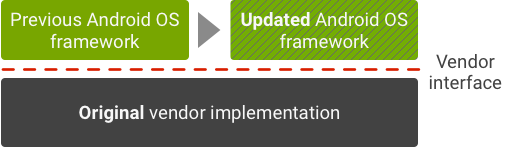

# Android
AOSP (android open source project)

<https://source.android.google.cn>
# overview

- **Application framework**. The application framework is used most often by
application developers. As a hardware developer, you should be aware of
**developer APIs as many map directly to the underlying HAL interfaces** and
can provide helpful information about implementing drivers.

- **Binder IPC**. The Binder **Inter-Process Communication (IPC)** mechanism
allows the application framework to cross process boundaries and call into
the Android system services code. This enables high level framework APIs to
interact with Android system services. At the application framework level,
this communication is hidden from the developer and things appear to "just
work".

- **System services**. System services are **modular, focused components**
such as Window Manager, Search Service, or Notification Manager.
Functionality exposed by application framework APIs communicates with system
services to access the underlying hardware. Android includes two groups of
services: system (such as Window Manager and Notification Manager) and media
(services involved in playing and recording media).

- **Hardware abstraction layer (HAL)**. A HAL defines a standard interface
for hardware vendors to implement, which enables Android to be agnostic about
lower-level driver implementations. Using a HAL allows you to implement
functionality without affecting or modifying the higher level system. HAL
implementations are packaged into modules and loaded by the Android system at
the appropriate time.

- **Linux kernel**. Developing your device drivers is similar to developing a
typical Linux device driver. Android uses a version of the Linux kernel with
a few special additions such as Low Memory Killer (a memory management system
that is more aggressive in preserving memory), wake locks (a PowerManager
system service), the Binder IPC driver, and other features important for a
mobile embedded platform. These additions are primarily for system
functionality and do not affect driver development. You can use any version
of the kernel as long as it supports the required features (such as the
binder driver).
# HAL interface definition language (HIDL)

**Android 8.0** re-architected the Android OS framework (in a project known as
**Treble**) to make it easier, faster, and less costly for manufacturers to
**update devices to a new version of Android**. In this new architecture, the
HAL interface definition language (HIDL, pronounced "hide-l") specifies the
interface between a HAL and its users, **enabling the Android framework to be**
**replaced without rebuilding the HALs**.
HIDL **separates the vendor implementation** (device-specific, lower-level
software written by silicon manufacturers) **from the Android OS framework**
via a new vendor interface. Vendors or SOC makers build HALs once and place
them in a `/vendor` partition on the device; the framework, in its own
partition, can then be replaced with an **over-the-air (OTA) update** without
recompiling the HALs.

- In Android 7.x and earlier

- In Android 8.0 and higher

All new devices launching with Android 8.0 and higher can take advantage of
the new architecture. To ensure forward compatibility of vendor
implementations, the vendor interface is validated by the **Vendor Test Suite
(VTS)**, which is analogous to the **Compatibility Test Suite (CTS)**.
# HAL

## HAL Types

**Devices running Android 8.0 and higher must support HALs written in the HIDL language**,
with a few exceptions listed below. These HALs can be binderized
or passthrough:
- **Binderized HALs.** HALs expressed in HAL interface definition language
(HIDL). These HALs replace both conventional and legacy HALs used in earlier
versions of Android. In a Binderized HAL, the Android framework and HALs
communicate with each other using binder inter-process communication (IPC)
calls. All devices launching with Android 8.0 or later must support
binderized HALs only. - **Passthrough HALs.** A HIDL-wrapped conventional or
legacy HAL. These HALs wrap existing HALs and can serve the HAL in binderized
and **same-process (passthrough) modes**.
**Conventional & legacy HALs**

**Conventional HALs** (deprecated in Android 8.0) are interfaces that conform
to a specific named and versioned **application binary interface (ABI)**.
**The bulk of Android system interfaces** (camera, audio, sensors, etc.) are
in the form of conventional HALs, which are defined under
`hardware/libhardware/include/hardware`.

**Legacy HALs** (also deprecated in Android 8.0) are interfaces that predate
conventional HALs. A few important subsystems (Wi-Fi, Radio Interface Layer,
and Bluetooth) are legacy HALs. Parts of some legacy HALs are contained in
`libhardware_legacy`, while other parts are interspersed throughout the
codebase.

# HIDL

HAL interface definition language or HIDL (pronounced "hide-l") is an
interface description language (IDL) to specify the interface between a HAL
and its users. It allows specifying types and method calls, collected into
interfaces and packages. More broadly, HIDL is a system for communicating
between codebases that may be compiled independently.

HIDL is intended to be used for inter-process communication (IPC).
Communication between processes is referred to as***Binderized***. For
libraries that must be linked to a process, a **passthrough** mode is also
available (not supported in Java).

HIDL specifies data structures and method signatures, organized in interfaces
(similar to a class) that are collected into packages. The syntax of HIDL
will look familiar to C++ and Java programmers, though with a different set
of keywords. HIDL also uses Java-style annotations.

## HIDL Terminology

This section uses the following HIDL-related terms:

|                        |                                                              |
| ---------------------- | ------------------------------------------------------------ |
| binderized             | Indicates HIDL is being used for remote procedure calls between processes, implemented over a Binder-like mechanism. See also *passthrough*. |
| callback, asynchronous | Interface served by a HAL user, passed to the HAL (via a HIDL method), and called by the HAL to return data at any time. |
| callback, synchronous  | Returns data from a server's HIDL method implementation to the client. Unused for methods that return void or a single primitive value. |
| client                 | **Process that calls methods of a particular interface**. A HAL or framework process may be a client of one interface and a server of another. See also *passthrough*. |
| extends                | Indicates an interface that adds methods and/or types to another interface. An interface can extend only one other interface. Can be used for a minor version increment in the same package name or for a new package (e.g. a vendor extension) to build on an older package. |
| generates              | Indicates **an interface method that returns values to the client**. To return one non-primitive value, or more than one value, a synchronous callback function is generated. |
| interface              | Collection of methods and types. Translated into a class in C++ or Java. All methods in an interface are called in the same direction: a client process invokes methods implemented by a server process. |
| oneway                 | When applied to a HIDL method, indicates the **method returns no values and does not block**. |
| package                | Collection of interfaces and data types sharing a version.   |
| passthrough            | Mode of HIDL in which the server is a shared library, `dlopen`ed by the client. In passthrough mode, client and server are the same process but separate codebases. Used only to bring legacy codebases into the HIDL model. See also *Binderized*. |
| server                 | **Process that implements methods of an interface**. See also *passthrough*. |
| transport              | HIDL infrastructure that moves data between the server and client. |
| version                | Version of a package. Consists of two integers, major and minor. Minor version increments may add (but not change) types and methods. |

# TERMS

- HAL, hardware abstraction layer 

- HIDL, HAL interface definition layer 

- VTS, vendor test suits 

- ABI, application binary interface

- device tree

> **The devicetree is a data structure for describing hardware.**
> Rather than hard coding every detail of a device into an operating system,
> many aspects of the hardware can be described in a data structure that is
> passed to the operating system at boot time. The devicetree is used by
> OpenFirmware, OpenPOWER Abstraction Layer (OPAL), Power Architecture Platform
> Requirements (PAPR) and in the standalone Flattened Device Tree (FDT) form.

- ODM, origianl design manufacturer

- OEM, original equipment manufacturer

- IPC, inter-process communication

- compatibiliby 

    - forward compatibility:

    a design characteristic that **allows a system to accept input intended for a later version of itself**. 
    在较低档计算机上编写的程序，可以在同一系列的较高档计算机上运行

    - backward compatibility: 

    计算机中指在一个程序和/或库更新到较新版本后，用旧版本程序创建的文档或系统仍能被正常操作或使用（包括写入），或在旧版本库的基础上开发的程序仍能正常编译运行的情况。

- SoC, system on chip