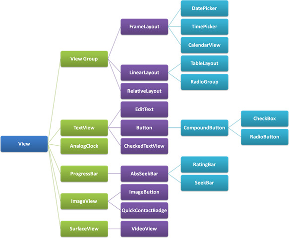

# class hierarchy



# Layout

A layout defines the structure for a user interface in your app, such as in an activity. All elements in the layout are built using a hierarchy of `View` and `ViewGroup` objects. A `View` usually draws something the user can see and interact with. Whereas a `ViewGroup` is an invisible container that defines the layout structure for `View` and other `ViewGroup` objects


```xml
<?xml version="1.0" encoding="utf-8"?>
<LinearLayout xmlns:android="http://schemas.android.com/apk/res/android"
              android:layout_width="match_parent"
              android:layout_height="match_parent"
              android:orientation="vertical" >
    <TextView android:id="@+id/text"
              android:layout_width="wrap_content"
              android:layout_height="wrap_content"
              android:text="Hello, I am a TextView" />
    <Button android:id="@+id/button"
            android:layout_width="wrap_content"
            android:layout_height="wrap_content"
            android:text="Hello, I am a Button" />
</LinearLayout>
```

## Attr

> `android:` , android namespace

`id`,  integer generate to `R.java`

```
android:id="@+id/view_name"
```

> Layout Parameters, XML layout attributes named `layout_something` define layout parameters for the View that are appropriate for the ViewGroup in which it resides.

Every ViewGroup class implements a nested class that extends `ViewGroup.LayoutParams`. 


All view groups include a width and height (`layout_width` and `layout_height`), 

**density-independent pixel** units (dip)

- wrap_content tells your view to size itself to the dimensions required by its content.
- match_parent tells your view to become as big as its parent view group will allow.


## LinearLayout

`android:orientation`= "horizontal" or "vertaical"

`android:layout_weight`

它用于描述该**子元素在剩余空间中占有的大小比例**。加入一行只有一个文本框，那么它的**默认值就为0**，如果一行中有两个等长的文本框，那么他们的android:layout_weight值可以是同为1。如果一行中有两个不等长的文本框，那么他们的android:layout_weight值分别为1和2，那么第一个文本框将占据剩余空间的1/3，第二个文本框将占据剩余空间中的2/3

```xml
<Button android:layout_weight="1" />  2/3
<Button android:layout_weight="2" />  1/3
```

- Equal distribution

To create a linear layout in which each child uses the same amount of space on the screen, set the `android:layout_height` of each view to `"0dp"` (for a vertical layout) or the `android:layout_width` of each view to `"0dp"` (for a horizontal layout). Then set the `android:layout_weight` of each view to `"1"`.

- Unequal distribution

You can also create linear layouts where the child elements use different amounts of space on the screen:

1. If there are **three text fields** and **two** of them declare a **weight of 1**, while **the other is given no weight**, the third text field **without weight doesn't grow**. Instead, this third text field occupies only the **area required by its content**. The other two text fields, on the other hand, expand equally to fill the space remaining after all three fields are measured.
2. If there are three text fields and **two of them declare a weight of 1**, while the **third** field is then given a **weight of 2** (instead of 0), then it's now declared more important than both the others, so it gets half the total remaining space, while the first two share the rest equally.


```xml
<?xml version="1.0" encoding="utf-8"?>
<LinearLayout xmlns:android="http://schemas.android.com/apk/res/android"
    android:layout_width="match_parent"
    android:layout_height="match_parent"
    android:paddingLeft="16dp"
    android:paddingRight="16dp"
    android:orientation="vertical" >
    <EditText
        android:layout_width="match_parent"
        android:layout_height="wrap_content"
        android:hint="@string/to" />
    <EditText
        android:layout_width="match_parent"
        android:layout_height="wrap_content"
        android:hint="@string/subject" />
    <EditText
        android:layout_width="match_parent"
        android:layout_height="0dp"
        android:layout_weight="1"
        android:gravity="top"
        android:hint="@string/message" />
    <Button
        android:layout_width="100dp"
        android:layout_height="wrap_content"
        android:layout_gravity="right"
        android:text="@string/send" />
</LinearLayout>
```

## AdapterView

`AdapterView` is a `ViewGroup` that displays items loaded into an `Adapter`. The most common type of adapter comes from an array-based data source.

```java
// Get a Spinner and bind it to an ArrayAdapter that
// references a String array.
Spinner s1 = (Spinner) findViewById(R.id.spinner1);
ArrayAdapter adapter = ArrayAdapter.createFromResource(
    this, R.array.colors, android.R.layout.simple_spinner_item);
adapter.setDropDownViewResource(android.R.layout.simple_spinner_dropdown_item);
s1.setAdapter(adapter);
```


# Dialog

base class `Dialog`

**AlertDialog**
A dialog that can show a title, up to three buttons, a list of selectable items, or a custom layout.
**DatePickerDialog** or **TimePickerDialog**
A dialog with a pre-defined UI that allows the user to select a date or time.

These classes define the style and structure for your dialog, but you should use a `DialogFragment` as a container for your dialog.

Using `DialogFragment` to manage the dialog ensures that it correctly handles lifecycle events such as when the user presses the *Back* button or rotates the screen.

## building

`DialogFragment`

```java
public class FireMissilesDialogFragment extends DialogFragment {
    @Override
    public Dialog onCreateDialog(Bundle savedInstanceState) {
        // Use the Builder class for convenient dialog construction
        AlertDialog.Builder builder = new AlertDialog.Builder(getActivity());
        builder.setMessage(R.string.dialog_fire_missiles)
               .setPositiveButton(R.string.fire, new DialogInterface.OnClickListener() {
                   public void onClick(DialogInterface dialog, int id) {
                       // FIRE ZE MISSILES!
                   }
               })
               .setNegativeButton(R.string.cancel, new DialogInterface.OnClickListener() {
                   public void onClick(DialogInterface dialog, int id) {
                       // User cancelled the dialog
                   }
               });
        // Create the AlertDialog object and return it
        return builder.create();
    }
}
```

> call `show()` to display the dialog

# App bar(action bar)

 Using the app bar makes your app consistent with other Android apps, allowing users to quickly understand how to operate your app and have a great experience. The key functions of the app bar are as follows:

- A dedicated space for giving your app an identity and indicating the user's location in the app.
- Access to important actions in a predictable way, such as search.
- Support for navigation and view switching (with tabs or drop-down lists).


