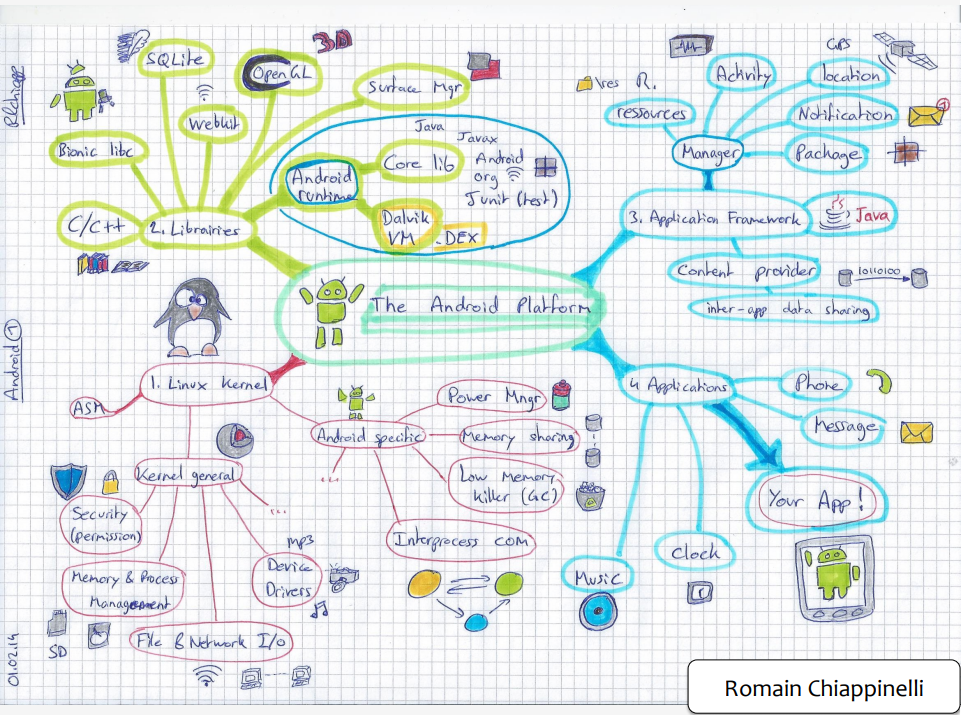
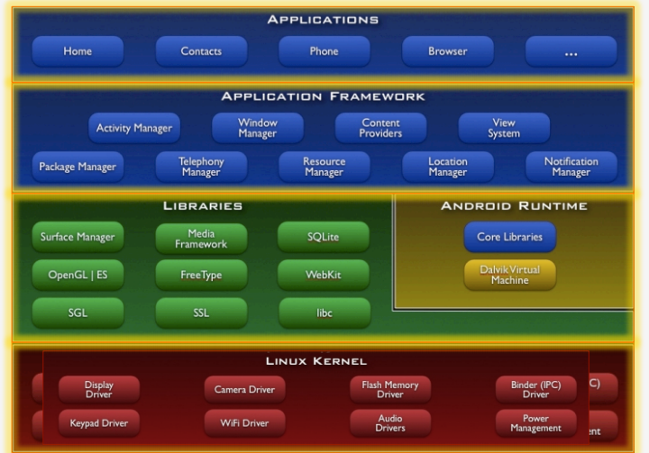
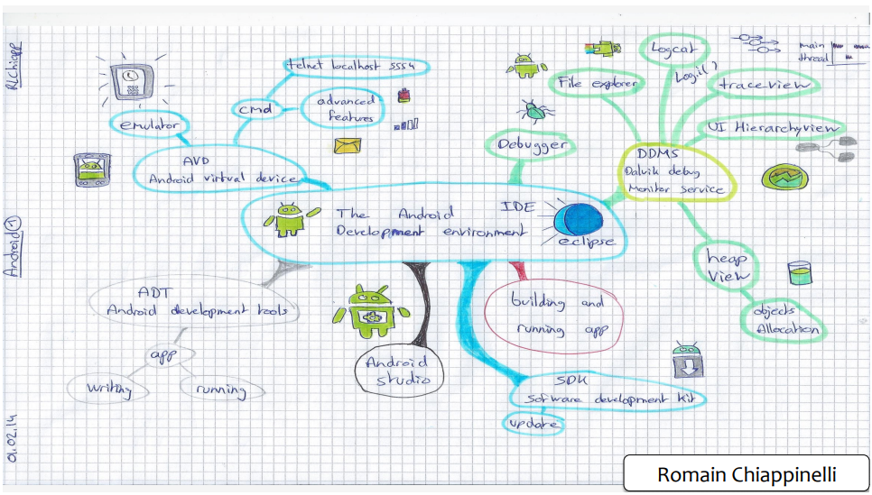
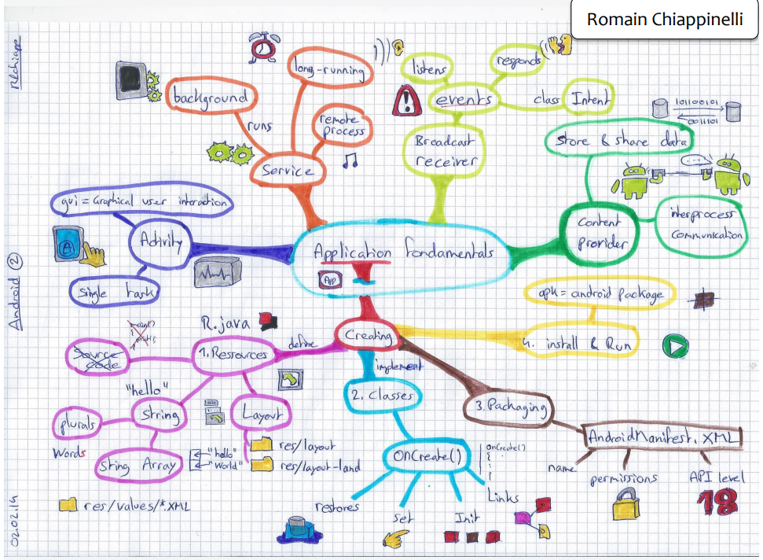
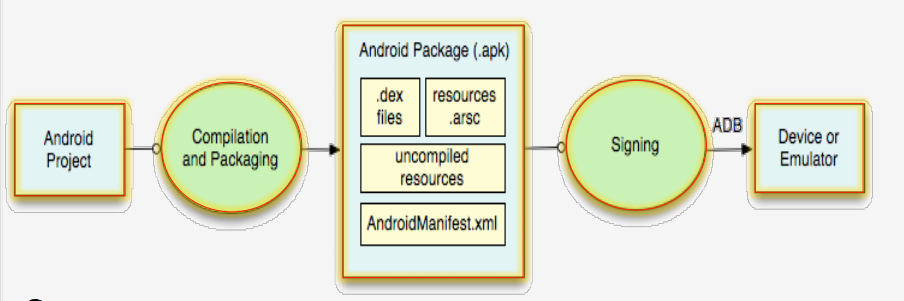
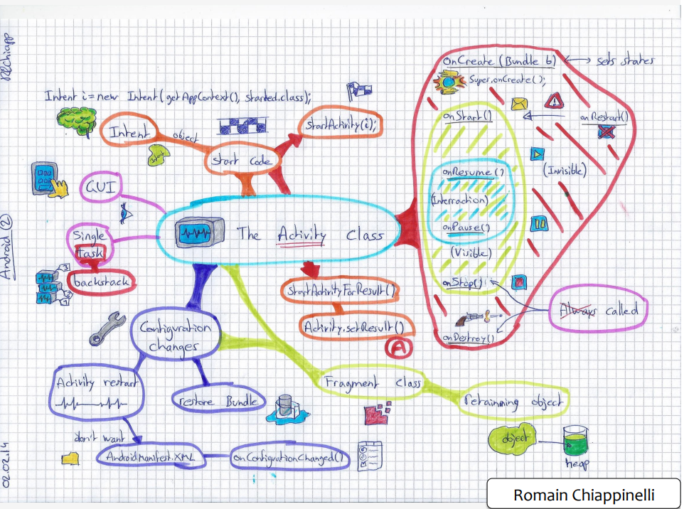
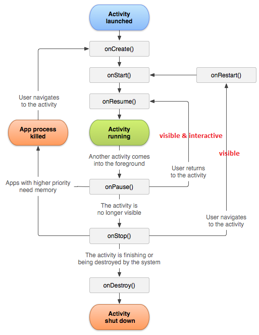
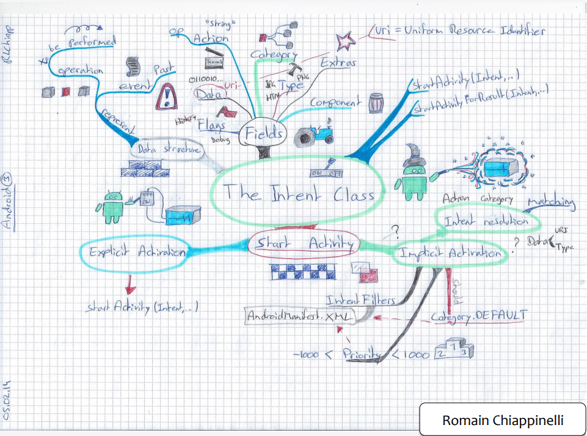
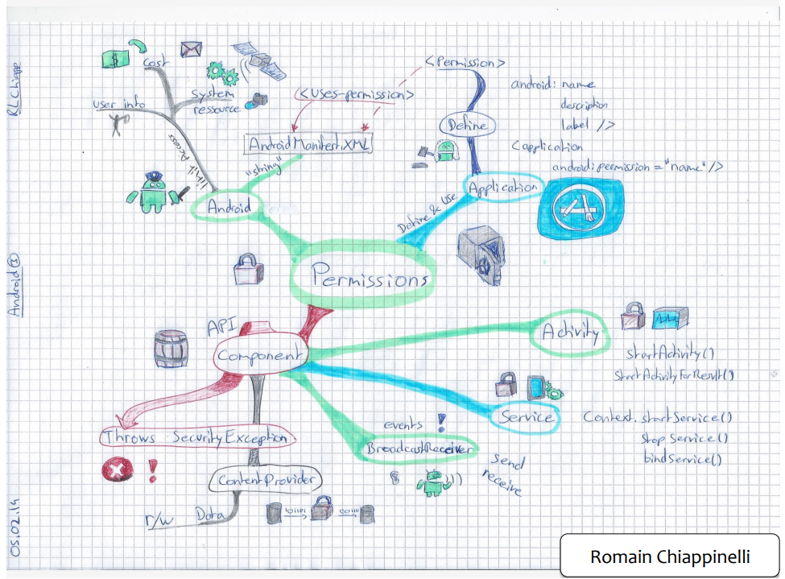
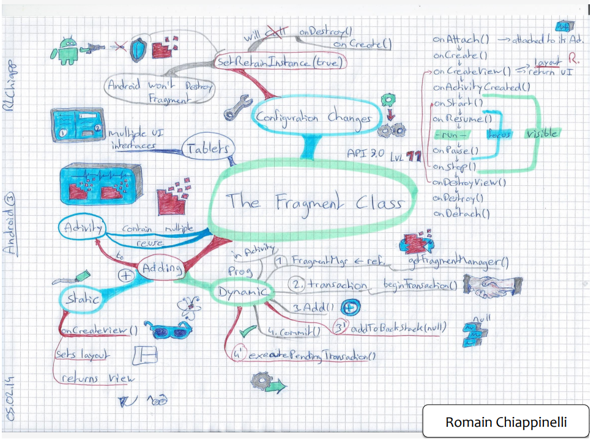

<https://www.coursera.org/learn/android-programming/home/welcome>

Programming Mobile Applications for Android Handheld Systems: Part 1
by University of Maryland, College Park

# syllabus

**code**

<https://github.com/aporter/coursera-android>

The material in this course is delivered as two four week mini courses, called part one and part two. 

Part one introduces the Android platform and its development tools. And it explains the basic concepts you'll need to create simple Android apps. 

- week one, Android **platform** and the Android **development environment**. 
- week two, we'll cover how apps are created and we'll go over the **activity** class, which is the primary class that's responsible for presenting an apps user interface. 
- week three, I'll introduce **intents and permissions**, which allow one app or activity to start up and use other apps and activities. And the **fragment** class, another class that plays a key role in presenting an apps user interface. 
- week four, I'll go into detail about the full range of classes and patterns used to create sophisticated user interfaces.

Part two, on the other hand, dives into the additional services that come into play when you're ready to create more advanced apps. 

- week five, we'll discuss a number of topics, including **user notifications**, **event notification** using the **broadcast receiver** class and using alarms to invoke code at prescheduled times. 
- Week six discusses how to handle **concurrency** with threads, **Asynctasks** and handlers, and also discusses how to acquire data over the internet. 
- Week seven gets into more visual topics, including **graphics** and **animation**, **touch processing**, and **multimedia**.
- week eight, we'll focus on using the many **sensors** that now come standard on most handheld devices. how to **manage and store data**.

# introduction to Android Platform



##  The Android platform

- A software stack for mobile devices:

OS kernel, system libraries, application
frameworks & key apps

- Android SDK for creating apps

Libraries & development tools 

## Android Architecture



Now this graphic represents the Android software stack. And as you can see,

- the **Linux kernel** layer. 
- Above that, there are **system libraries** and the Android run time system. 
- Above that, there's a rich **application framework** player to support the development of new applications. 
- And at the very top, Android provides some **standard applications**, again, things like the phone dialer, the web browser, and the contacts database. 

### Linux kernel layer. 

**standard services**

- security
- memory & process management
- file & network i/o
- device driver

The Linux kernel layer is the lowest layer of software in the Android platform. This layer provides the core services that
any Android computing device will rely on. Android's Linux kernel, just like any Linux kernel, provides
generic operating system services. For example,
it provides a permissions architecture so that you can restrict access to data and resources to only those processes
that have the proper authorizations. It supports memory and process management,
so that multiple processes can run simultaneously without
interfering with each other. It handles low-level details of file and
network I/O. And it also allows device drivers to
be plugged in so that Android can communicate with a wide range of
low-level hardware components that are often coupled to computing devices,
things like memory and radios and cameras. 

**android specific**

- Power management
- Android shared memory
- Low memory killer
- Interprocess communication

In addition to the common services
supported by any Linux kernel, Android's Linux kernel also includes
several Android-specific components. 

Android's Linux kernel includes its own power management services because mobile
devices often run on battery power. 

It provides its own memory sharing and memory management features, because
mobile devices often have limited memory. 

And Android's Linux kernel also includes its own inter-process communication mechanism called the binder, which allows
multiple processes to share data and services in sophisticated ways.

### system library & android runtime

**system library**

- libc
- Surface Mgr: Display management
- Media Framework: Audio/ Video
- Webkit: browser engine
- OpenGL: Graphics engines
- SQLite Relational database

Next layer up includes a variety of system libraries. 
These libraries are typically
written in C and C++, and for that reason they are often
referred to as the native libraries. And these native libraries
handle a lot of the core, performance-sensitive activities
on your device, things like quickly rendering web
pages and updating the display. And for example, Android has its own

System C Library, which implements the standard OS system calls, which do
things like process and thread creation, mathematical computations,
memory allocation, and much more. There's the 

Surface Manager, for updating the display. 
A media framework, for playing back audio and video files. 
Webkit, for rendering and displaying web pages. 
OpenGL for high performance graphics. And 
SQLite for managing in-memory relational databases. 

**Android Runtime**

Android Runtime, which supports writing and running Android applications. 
And there are two components in
the Android Runtime that we'll talk about today, the 

- core Java libraries 

```
basic java classes -- java.*, javax.*
app lifecycle -- android.*
Internet/Web services -- org. *
Unit testing -- junit
```

- the Dalvik Virtual Machine. 


The Dalvik virtual machine is
the software that actually executes Android applications. Now as I just told you, Android
applications are typically written in Java, so you might have assumed that
since they're written in Java they would probably run on a standard Java virtual
machine, but in fact that's not the case. 

**typical workflow**

- developers first write their applications in the Java programming language. 
- Then a Java compiler will compile the Java source code files into multiple Java bytecode files. 
- Next, a tool called DX transforms the Java bytecodes into a single file of a different bytecode format called DEX, and this bytecode file is usually called classes.dex. 
- Next the DEX file is packaged with other application resources and installed on the device. 
- And finally when the user launches the application, the Dalvik Virtual Machine will then execute the classes.dex file. 

Now the reason for doing all this
is that the Dalvik Virtual Machine, unlike the the Java Virtual Machine,
was specifically designed to run in the **resource-constrained environment**
which is typical of mobile devices. Now when I say resource-constrained, what I mean is that compared
to a typical desktop device, the typical mobile device is less
powerful and more limited in many ways. For example, it will probably have
a slower CPU, less memory and a limited battery life. So if you're interested in finding out
more about the Dalvik Virtual Machine itself then I recommend you take
a look at this video, 

Dalvik Virt, VM Internals by Dan Bornstein of Google. 

### application framework

The application framework contains reusable software that many mobile applications
are likely to need. For example, as we'll see in a minute, the 

**View system** contains common graphical
elements, things like buttons, and icons, that many applications
include in their user interfaces. Let's take a deeper look at
some of these components. One application framework
component is the 

**Package Manager**. The Package Manager is
essentially a database that keeps track of all the applications
currently installed on your device. So here's the home screen of my phone. When I click on the Launcher icon,
the phone shows me a bunch of icons, each one representing an application
package that's stored on my phone. The Package Manager stores information
about these applications, and that's useful for several reasons. For example, it allows applications
to find and contact each other so that one application can share data
with another application, or so that one application can
request services from another. 

Another application framework component is the **Window Manager**. 
The Window Manager, as the name suggests, manages the many
windows that comprise applications. Here I'm launching the Browser
application, which appears as two windows. At the top,
there's the System Notification bar, which displays various status indicators
that tell the user about things like WiFi signal strength, remaining
battery power, and the current time. There's also a Main Application window, that in this case is showing
the current web page. An application can also
use various sub windows, such as when it shows menus or dialogs. As I mentioned earlier, the application
framework also contains the View System. The View System contains many common
graphical user interface elements, such as icons, text entry boxes,
buttons, and much more.

The next application framework
component is the **Resource Manager**. This component manages the non-compiled
resources that make up an application, things like strings, graphics,
and user interface layout files. And to give you example of
non-compiled resources, let's go back to the phone
application again. Now this tab has some English words on it,
and that's fine because I speak English. But Android is available around the world,
it's not limited to English speakers, and so it's important that we have an easy
way to customize applications for other languages. And one way that Android
supports that is that, that it lets you define
strings in multiple languages. For example, the phone
application has a string file for Italian words as well as one for
English words. So if you speak Italian, then you can
go into the Settings application and select Italian as your default language.

**Activity Manager**. Now at a high level, Android activities often correspond
to a single user interface screen. Applications are then
created by stringing together multiple activities through
which the user can navigate. The Activity Manager helps to coordinate
and support that kind of navigation. So suppose I want to listen to some music. So here I'll click on the Launcher
icon to show my applications. From there,

Another application framework component
implements **Content Providers**. Content Providers are essentially
databases that allow applications to store and share structured information. For example, here we see that the phone
application can access stored contact information and
use it to dial a phone number. And it can do that because
the contact information is stored in a Content Provider. And even better, Content Providers are
designed to work across applications so not only can the phone dialer use
the contact information, but so can the MMSM, messaging application and
so can various social media applications. Let's take a look. So going back to the phone application, I can select the Contact tab to
access stored contact information. I can select one of the contacts
to quickly dial that contact. Now as I said, I can do that
because contact information is stored in a Content Provider. And again, even better, Content Providers
are designed to work across applications. So not only can the phone dialer use
the contacts, but so can the MMS messaging application, and so can Twitter, Facebook,
my email readers, and things like that. The next application framework

component is the **Location Manager**. The Location Manager allows
applications to receive location and movement information,
such as that generated by the GPS system. And this allows applications to
perform context-specific tasks, things like finding directions
from the current location. Now here I'm calling up
the Google Maps application, which queries the Location Manager for
my current location, and then shows a map of the area
around that current location. The last application framework

component I'll talk about today is the **Notification Manager**. The Notification Manager allows
applications to place information in the Notification bar, for example, to let users know that
certain events have occurred. For example, suppose I want to
send my wife an MMS message. And let's suppose that at right at
this minute, she's writing an email or making a phone call or whatever. So although she probably wants to know
that I've sent her an MMS message, she might not want that
to disrupt her right now. Well, Android handles this
with a Notification Manager. And the way that works is that there's
some software running on her phone that's always listening for
incoming MMS messages. When one arrives, that software uses
the Notification Manager to place an icon in her phone's Notification bar. And that's shown as
a little smiley face icon. And I've whited out some of the,
some of the information there for privacy. Now when she's ready,
she can pull down on the Notification bar, which then shows more information
about the specific notification. And if she clicks on that notification,
the MMS application will start up and she can read and
hopefully respond to my message. 

### application

The last layer of the Android software
stack is the Application layer. As I said earlier, Android comes
with some built-in applications, and these include things like the home screen, the phone dialer, the web browser,
an email reader, and more. And one of the things that's really
nice about Android is that none of these apps is hard-coded into the system. If you have a better app,
**you can substitute your app for any of these standard apps**.

# Android development enviroment



**Android platform**

A multi-layered software stack for building and running mobile applications 

**Android paltform enviroment**

your workbench for writing, build, debug, test your android appliction

<https://www.runoob.com/w3cnote/android-tutorial-development-environment-build.html>

<https://developer.android.com/studio/intro>

- Downloading Android SDK

[android-sdk-bundle](developer.android.com)

Android platform
Android Studio IDE
Key development tools
**System image** for emulator

- Using the Android Studio IDE
- Using the Android emulator
- Debugging Android applications
- Other tools 

**Android virtual devices(AVD)**

## Emulators

**pros**

- doesn's require an actual device
- Hardware is reconfigurable
- Changes are non-destructive 

**cons**

- Can be very slow
- Some features unavailable e.g., no support for bluetooth or USB connections
- Performance / user experience can be misleading

### advanced features

1. Can emulate many different device, user characteristics and scenario. such as:

    - Network speed/latencies
    - Battery power
    - Location coordinate

2. Emulate incoming phone calls & SMS messages 

3. Can interconnect multiple emulators 

## Dalvik debug monitor service

deprecated in android studio 3+, use `Profile` instead

DDMS tools include

- File Explorer, use `device file explore` instead
- Logcat, short cut <kbd>alt + 6</kbd>
- Traceview, use `profile` instead
- Hierarchyview, use `layout inspector` instead

# Application fundamentals



## components

- **Activities** are designed to provide a graphical user interface, or a gui, to the user. And this enables users to give and receive information to and from an application
- **services** for supporting **long-running** or in the **background** operations. 
- **Broadcast receivers** that **listen for and respond to events** that happen on a device. 
- **content providers** which allow multiple applications to store and share data, **IPC**

## workflow



1. Define resources
2. Implement application classes
3. Package application
4. Install & run application
5. debug and test
6. iterate

## app resource & alternate resource

`res/`

`R.java`

`AndroidManifest.xml`

**code**

```java
R.string.app_name
```

```xml
@string/app_name
```

## Activity class

a visual interface for user interaction 



**overview**

- The activity class
- The task backstack
- The activity lifecycle
- Starting activities
- handle configration changes

### tasks & the task backstack

**task**

A Task is a set of related Activities

These related activities don’t have to be
part of the same application

Most tasks start at the home screen

eg, a task to share a photo using snapchat.

- launch snapchat
- use camera snapshoot
- return to snap chat
- share

**task backstack**

When an Activity is launched, it goes on top of the backstack

When the Activity is destroyed, it is popped off the backstack


### activity lifecycle

Activities are created, suspended, resumed & destroyed as necessary when an application executes



Some of these actions depend on user behavior

Some depend on Android
> Android can kill activities when it's in low memory

**activiy state**

- Resumed/Running - visible, user interacting
- Paused - visible, user not interacting, can be terminated
- Stopped - not visible, can be terminated 

#### handle activity state change

Different events, some user-triggered and some system-triggered, can cause an `Activity` to transition from one state to another.

##### Configuration change occurs

There are a number of events that can trigger a configuration change. Perhaps the most prominent example is a change between portrait and landscape orientations. Keyboard, orientation, locale, etc.

Device configuration can change at runtime 

When a configuration change occurs, the activity is **destroyed and recreated**. The original activity instance will have the`onPause()`, `onStop()`, and `onDestroy()` callbacks triggered. A new instance of the activity will be created and have the `onCreate()`, `onStart()`, and `onResume()` callbacks triggered.

Now, since configuration changes
can happen frequently while using an application, you want to make sure
that your lifecycle method code is fast. Consider device orientation changes,
for example. If you move the device from portrait
mode to landscape mode, and back to portrait mode, that will cause the current
activity to be killed and restarted twice. So if your startup code is slow, that's really going to affect your
users' experience with your application. So, to improve the speed of
configuration changes if you need it, Android allows you to do two things. 

- One, as the change is occurring, you can create and save an arbitrary Java object that essentially caches important state information. 
- two, you can manually handle the configuration change, avoiding the whole shutdown and restart sequence all together. 

one, to speed up reconfiguration, you can cached hard to recompute data and store it in a Java object. And one way to do this is by overriding
the `onRetainNonConfigurationInstance` method, which will be called some
time between onStop and onDestroy. And the object that you build and return in onRetainNonConfigurationInstance can be retrieved when the activity is recreated by calling
`getLastNonConfigurationInstance`. And that's usually done during the call to
the activity's onCreate method when you recreate the activity. 

**note** that these methods have been **deprecated** in favor of other methods in the Fragment class.


```xml
<activity android:name=".MyActivity“"
android:configChanges="orientation|screensize|keyboardHidden">
```

the second thing you can do to speed up reconfiguration is to avoid the whole kill and restart sequence altogether for specific configuration changes. And to do this, you declare
those specific changes that the, your activity will handle in the `AndroidManifest.xml` file. 

For example, this XML snippet indicates that MyActivity will manually handle changes in device orientation and
screen size and keyboard accessibility. So, if you do handle some configuration changes manually, then when those configuration
changes occur in runtime, your activity will receive a call to `onConfigurationChanged`. And as a parameter, this method
will receive a Configuration object which details the new configuration, so your code can then read this object and
make whatever changes it needs to.  

##### Lose focus

If a new activity or dialog appears in the foreground, taking focus and partially covering the activity in progress, the covered activity **loses focus** and enters the Paused state. Then, the system calls `onPause()` on it.

When the covered activity returns to the foreground and regains focus, it calls `onResume()`.

If a new activity or dialog appears in the foreground, taking focus and **completely covering the activity** in progress, the covered activity loses focus and enters the Stopped state. The system then, in rapid succession, calls `onPause()` and`onStop()`.

When the same instance of the covered activity comes back to the foreground, the system calls `onRestart()`,`onStart()`, and `onResume()` on the activity. If it is a new instance of the covered activity that comes to the background, the system does not call onRestart(), only calling `onStart()` and `onResume()`.

##### User taps Back button 

If an activity is in the foreground, and the user taps the **Back** button, the activity transitions through the `onPause()`,`onStop()`, and `onDestroy()` callbacks. In addition to being **destroyed**, the activity is also **removed from the back stack**.

It is important to note that, by default, the `onSaveInstanceState()` callback does not fire in this case. This behavior is based on the assumption that the user tapped the **Back** button with no expectation of returning to the same instance of the activity. However, you can override the `onBackPressed()` method to implement some custom behavior, for example a "confirm-quit" dialog.

##### System kills app process

If an app is in the background and the system needs to free up additional memory for a foreground app, the background app can be killed by the system to free up more memory.

### lifecycle callback

#### onCreate()

You must implement this callback, which fires when the system first creates the activity. On activity creation, the activity enters the *Created* state. In the `onCreate()` method, you perform basic application startup logic that should happen only once for the entire life of the activity.

This method receives the parameter `savedInstanceState`, which is a Bundle object containing the **activity's previously saved state**.

**initializes** the activity

- Call super.onCreate()
- Set the Activity’s content view
- Retain references to UI views as necessary
- Configure views as necessary

#### onRestart()

Called if the Activity has been stopped and is about to be started again

Typical actions

- Special processing needed only after having been stopped

#### onStart()

Activity is about to become **visible, but not interactive**

Typical actions

- Start when visible-only behaviors
- Loading persistent application state

#### onResume()

Activity is visible and **about to** start interacting with user

Typical actions

- Start foreground-only behaviors

#### onPause()

Focus about to switch to another Activity, **lose focus**

Typical actions

- Shutdown foreground-only behaviors
- Save persistent state

#### onStop()

Activity is **no longer visible** to user may be restarted later

Typical actions

- Cache state

> Note: may not be called if Android kills your application

#### onDestroy()

Activity is about to be destroyed, `back` button

Typical actions

- Release Activity resources

> Note: may not be called if Android kills your application

### start a activity

startActivity()

> startActivity will start up the desired activity, pushing the current activity out of the foreground. 

startActivityForResult()

> startActivityForResult will also start up the desired activity, but it will do so with the expectation that the started activity will provide a result back to that calling activity. the result is communicated back by a call to that activity's `onActivityResult` method. And we'll come back to that in a few minutes.

## Intent & intent filter



a data structure that represents

- An operation to be performed 
- An event that has occurred

### intent field

-  **Action**, String representing **desired operation**
-  **Data**, Data associated with the Intent, Formatted as a Uniform Resource Identifier (**URI**)
-  **Category**, **Additional information about the components** that can handle the intent
-  **Type**, Specifies the MIME type of the Intent data, If unspecified, Android will infer the type
-  **Component**, The component that should receive this intent, Use this when there’s exactly one component that should receive the intent
-  **Extras**, Additional information associated with Intent, Treated as a map (key-value pairs
-  **Flags**, Specify how Intent should be handled

```java
// Action field
public static final String ACTION_DIAL = "android.intent.action.DIAL" // ACTION_DIAL – Dial a number
ACTION_EDIT – Display data to edit
ACTION_SYNC – Synchronize device data with server
ACTION_MAIN – Start as initial activity of app

// data field
// Data to view on a map
Uri.parse(“geo:0,0?q=1600+Pennsylvania+Ave+Washington+DC”);
// Number to dial in the phone dialer
Uri.parse(“tel:+15555555555”)

// category field
public static final String CATEGORY_LAUNCHER = "android.intent.category.LAUNCHER";
Category_browsable – can be invoked by a browser to display data ref’s by a URI
Category_launcher – can be the initial activity of a task & is listed in top-level app launcher

// type field
"image/*, image/png, image/jpeg"
"text/html, text/plain"

// component field
Intent(Context, Class)

// extras field
Intent newInt = new Intent(Intent.ACTION_SEND);
newInt.putExtra(android.content.Intent.EXTRA_EMAIL, new String[]{“aporter@cs.umd.edu”, “ceo@microsoft.com”, “potus@whitehouse.gov”,“mozart@musician.org”});

// flags
FLAG_ACTIVITY_NO_HISTORY, Don’t put this Activity in the History stack
FLAG_DEBUG_LOG_RESOLUTION, Print extra logging information when this Intent is processed
```

### explicit intent

specify the handle component

```java
// two activity, helloActivity, LoginActivity
Intent i = new Intent(Context, Componet);
startActivity(i)
```

### implicit intent

When the Activity to be activated is not explicitly named, Android tries to find Activities that match the Intent

This process is called **intent resolution**

- An Intent describing a desired operation

- IntentFilters which describe which operations an Activity can handle

    > Specified either in AndroidManifest.xml or programmatically

- action test
- category test
- data test

Each `<data>` element can specify a **URI** structure and a data type (**MIME media type**). Each part of the URI is a separate attribute: `scheme`, `host`, `port`, and `path`:

```
<scheme>://<host>:<port>/<path>
```

The following example shows possible values for these attributes:

```
content://com.example.project:200/folder/subfolder/etc
```

In this URI, the scheme is `content`, the host is `com.example.project`, the port is `200`, and the path is `folder/subfolder/etc`.

> A path specification can contain a wildcard asterisk (*) to require only a partial match of the path name.
> If an intent specifies a URI or MIME type, the data test will fail if there are no `<data>` elements in the `<intent-filter>`.

**only all 3 test passed, each test pass at least one, fiter matched**

```xml
<activity android:name="MainActivity">
    <!-- This activity is the main entry, should appear in app launcher -->
    <intent-filter>
        <action android:name="android.intent.action.MAIN" />
        <category android:name="android.intent.category.LAUNCHER" />
    </intent-filter>
</activity>

<activity android:name="ShareActivity">
    <!-- This activity handles "SEND" actions with text data -->
    <intent-filter>
        <action android:name="android.intent.action.SEND"/>
        <category android:name="android.intent.category.DEFAULT"/>
        <data android:mimeType="text/plain"/>
    </intent-filter>
    <!-- This activity also handles "SEND" and "SEND_MULTIPLE" with media data -->
    <intent-filter>
        <action android:name="android.intent.action.SEND"/>
        <action android:name="android.intent.action.SEND_MULTIPLE"/>
        <category android:name="android.intent.category.DEFAULT"/>
        <data android:mimeType="application/vnd.google.panorama360+jpg"/>
        <data android:mimeType="image/*"/>
        <data android:mimeType="video/*"/>
    </intent-filter>
</activity>
```

when **more than one activity can accept a particular intent** 

- one way to do that is just to ask the user which activity, he or she wants to handle the intent
- Another possibility is that **activities can specify a priority**. That Android will take into account when deciding between two different activities that can handle a particular intent. Now those priority values should be between **minus 1000 and positive 1000**. And higher values, mean higher priority.

## dump sys package info

```shell
adb shell dumpsys package > package_info.txt && vim package_info.txt
```

Now this is going to spit out a ton of information from the **package manager**. So I'll just capture the output of this command in to a text file.

## permission



### android security & permission

Each Android app lives in its own **security sandbox**, protected by the following **Android security features**:

- The Android operating system is a **multi-user Linux system** in which **each app is a different user**.
- By default, the system assigns each **app a unique Linux user ID** . The system **sets permissions for all the files** in an app so that only the user ID assigned to that app can access them.
- **Each process has its own virtual machine (VM)**, so an app's code runs in isolation from other apps.
- By default, every app runs in its own Linux process. The Android system starts the process when any of the app's components need to be executed

Android protects resources & data with permissions, Used to limit access to:

- User information – e.g, contacts
- Cost-sensitive API’s – e.g., SMS/MMS
- System resources – e.g., Camera

Permissions are represented as strings In **AndroidManifest.xml**

apps declare the permissions

- They use themselves
- They require of other components

Applications specify permissions they use through a `<uses-permission>` tag, Users must accept these permissions before an application can be installed

#### define permission

`<permission>`
`android:permission`

```xml
    <permission
        android:name="course.examples.permissionexample.BOOM_PERM"
        android:description="@string/boom_perm_string"
        android:label="@string/boom_permission_label_string"
        android:protectionLevel="dangerous"/>

    <!--  Enforces the BOOM_PERM permission on users of this application  -->
    <application
        android:allowBackup="true"
        android:icon="@mipmap/ic_launcher"
        android:theme="@style/MaterialTheme"
        android:label="@string/app_name"
        android:permission="course.examples.permissionexample.BOOM_PERM"
        tools:ignore="GoogleAppIndexingWarning">
        <activity
            android:name=".BoomActivity"
            android:label="@string/app_name" >
            <!-- Normally wouldn't put this IntentFilter because Launcher can't run it-->
            <intent-filter>
                <action android:name="android.intent.action.MAIN" />
                <category android:name="android.intent.category.LAUNCHER" />
            </intent-filter>
            
            <!--  Sets up an Intent Filter for the dangerous operation defined by the 
                   Action String "....boom_action"  -->
            <intent-filter>
                <action android:name="course.examples.permissionexample.boom.boom_action" />

                <category android:name="android.intent.category.DEFAULT" />
            </intent-filter>
        </activity>
    </application>
```

**NOTE**: `<permission>` is used to specify an application-specific permission that an application requires of any other application that wants to interact with it

### component permission

Individual components can set their own permissions, restricting which other components can access them

Component permissions take precedence over application-level permissions

#### activity

Restricts which components can start the associated activity Checked within execution of 
`startActivity()`, `startActivityForResult()`

Throws **SecurityException** on permissions failure

#### service

Restricts which components can start or bind to the associated service Checked within execution of
`Context.startService()`
`Context.stopService()`
`Context.bindService()`

Throws SecurityException on permissions failure

#### broadcastReciever

Restricts which components can send & receive broadcasts

Permissions checked in multiple places


#### content provider

Restrict which components can read & write the data in a ContentProvider

## Fragment class

Represents a behavior / portion of UI within an Activity

Multiple Fragments can be embedded in an Activity to create a multi-pane UI

A single Fragment can be reused across multiple Activities




### lifecycle


Usually, you should implement at least the following lifecycle methods:

- `onCreate()`

    The system calls this when creating the fragment. Within your implementation, you should initialize essential components of the fragment that you want to retain when the fragment is paused or stopped, then resumed.

- `onCreateView()`

    The system calls this when it's time for the fragment to draw its user interface for the first time. To draw a UI for your fragment, you must return a `View` from this method that is the root of your fragment's layout. You can return null if the fragment does not provide a UI.

- `onPause()`

    The system calls this method as the first indication that the user is leaving the fragment (though it doesn't always mean the fragment is being destroyed). This is usually where you should commit any changes that should be persisted beyond the current user session (because the user might not come back).

### adding fragment statically

```xml
<?xml version="1.0" encoding="utf-8"?>
<LinearLayout xmlns:android="http://schemas.android.com/apk/res/android"
    android:layout_width="match_parent"
    android:layout_height="match_parent"
    android:baselineAligned="false"
    android:orientation="horizontal"
    android:padding="@dimen/activity_margin">

    <fragment
        android:id="@+id/titles"
        class="course.examples.fragments.staticlayout.TitlesFragment"
        android:layout_width="0px"
        android:layout_height="match_parent"
        android:layout_weight="1" />

    <fragment
        android:id="@+id/details"
        class="course.examples.fragments.staticlayout.QuotesFragment"
        android:layout_width="0px"
        android:layout_height="match_parent"
        android:layout_weight="2" />

</LinearLayout>
```

```java
public class QuoteViewerActivity extends Activity implements ListSelectionListener {
    @Override
    protected void onCreate(Bundle savedInstanceState) {
        super.onCreate(savedInstanceState);

        // Get the string arrays with the titles and quotes
        mTitleArray = getResources().getStringArray(R.array.Titles);
        mQuoteArray = getResources().getStringArray(R.array.Quotes);
        mNoQuoteSelectedString = getResources().getString(R.string.noQuoteSelected);

        setContentView(R.layout.quote_activity);

        // Get a reference to the QuotesFragment
        mQuotesFragment = (QuotesFragment) getFragmentManager()
                .findFragmentById(R.id.details);
    }
```

### adding fragment dynamically

- Fragment transactions allow you to dynamically change your app’s user interface
- Can make the interface more fluid & take better advantage of available screen space

```xml
<LinearLayout xmlns:android="http://schemas.android.com/apk/res/android"
    android:layout_width="match_parent"
    android:layout_height="match_parent"
              android:padding="@dimen/activity_margin"
              android:baselineAligned="false"
              android:orientation="horizontal">

    <FrameLayout
        android:id="@+id/title_fragment_container"
        android:layout_width="match_parent"
        android:layout_height="match_parent" />

    <FrameLayout
        android:id="@+id/quote_fragment_container"
        android:layout_width="0dp"
        android:layout_height="match_parent" />

</LinearLayout>
```

```java
public class QuoteViewerActivity extends Activity implements ListSelectionListener {
    @Override
    protected void onCreate(Bundle savedInstanceState) {

        Log.i(TAG, getClass().getSimpleName() + ":entered onCreate()");

        super.onCreate(savedInstanceState);

        // Get the string arrays with the titles and quotes
        mTitleArray = getResources().getStringArray(R.array.Titles);
        mQuoteArray = getResources().getStringArray(R.array.Quotes);

        setContentView(R.layout.main);

        // Get references to the TitleFragment and to the QuotesFragment containers
        mTitleFrameLayout = findViewById(R.id.title_fragment_container);
        mQuotesFrameLayout = findViewById(R.id.quote_fragment_container);


        // Get a reference to the FragmentManager
        mFragmentManager = getFragmentManager();

        mQuoteFragment = (QuotesFragment) mFragmentManager.findFragmentById(R.id.quote_fragment_container);
        mTitleFragment = (TitlesFragment) mFragmentManager.findFragmentById(R.id.title_fragment_container);


        if (null == mFragmentManager.findFragmentById(R.id.title_fragment_container)) {

            // Start a new FragmentTransaction
            FragmentTransaction fragmentTransaction = mFragmentManager
                    .beginTransaction();

            mTitleFragment = new TitlesFragment();

            // Add the TitleFragment to the layout
            fragmentTransaction.add(R.id.title_fragment_container, mTitleFragment);

            // Commit the FragmentTransaction
            fragmentTransaction.commit();

        }

        // Set layout parameters
        setLayout();


        // Add a OnBackStackChangedListener to reset the layout when the back stack changes
        mFragmentManager
                .addOnBackStackChangedListener(new FragmentManager.OnBackStackChangedListener() {
                    public void onBackStackChanged() {
                        layoutAfterBackStackedChanged();
                    }
                });
    }

```

### configuration change

If you call `setRetainInstance(true)`, Android won’t destroy the Fragment on configuration change

- onDestroy() will not be called
- onCreate() will not be called